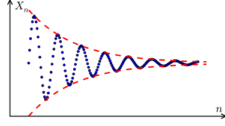
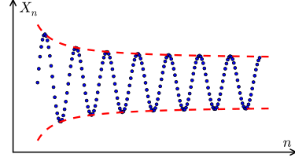
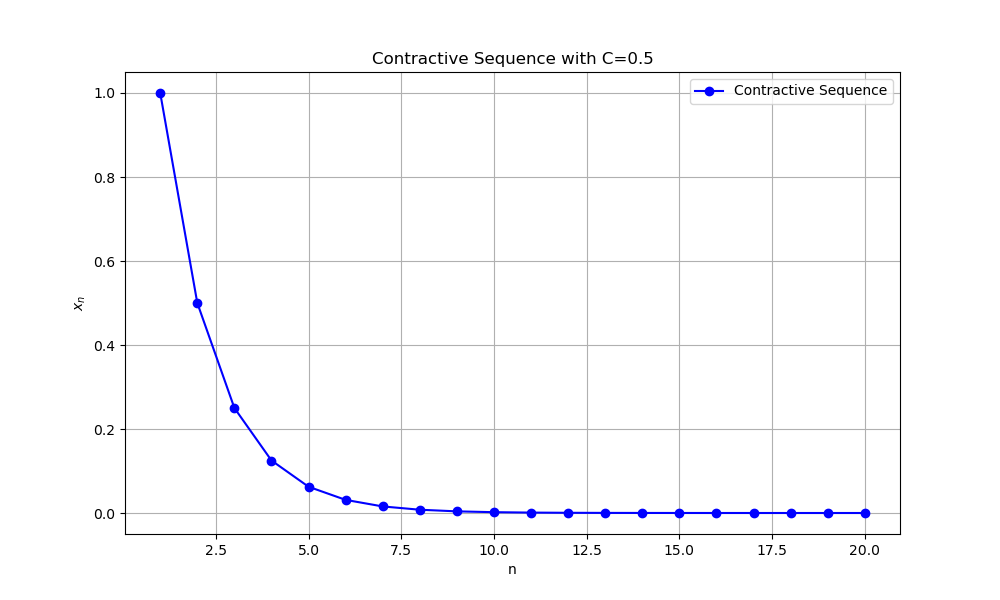

---
{"creation-time":"2025-04-09 08:38","status":"adult","tags":["content-type/conceptual"],"parent":["[[sequences and series]]"],"publish":true,"PassFrontmatter":true}
---

## Summary

### Definition

- [Cauchy sequence](#3.5.1%20Definition%20Cauchy%20sequence)
- [Contractive sequence](#3.5.7%20Definition%20Contractive%20sequence)

### Theorem

- $X$ sequence of real numbers
- $Y$ contractive sequence of real numbers

1. $X$ convergent $\leftrightarrow$ Cauchy $\rightarrow$ bounded
2. $Y$ $\rightarrow$ Cauchy
3. $Y$ $\rightarrow$ [3.5.10](#3.5.10%20Corollary)

## 3.5.1 Definition: Cauchy sequence

> A sequence $X=(x_{n})$ of real numbers
> is said to be a **Cauchy sequence**
> 
> if for every *$\varepsilon > 0$* *there exists $H(\varepsilon) \in \mathbb N$*
> such that for all *natural numbers $n,m \geq H(\varepsilon)$*,
> the terms $x_{n}, x_{m}$ satisfy *$|x_{n} - x_{m}| < \varepsilon$*.

- Cauchy sequence:

	|$x_{n} - x_{m}$| converges
	
  
- Not Cauchy sequence
	
	

## 3.5.3 Lemma

> If $X = (x_{n})$ is a *convergent sequence* of real numbers,
> then $X$ is a **Cauchy** sequence.

> [!NOTE]
> $X$ convergent and Cauchy is a biimplication as stated on [3.5.5](#3.5.5%20Thoerem%20Cauchy%20Converge%20Criterion)

## 3.5.4 Lemma

> A *Cauchy* sequence of real numbers is **bounded**.

## 3.5.5 Thoerem: Cauchy Converge Criterion

 > A *sequence of real numbers* is **convergent**
 > **if and only if it is a Cauchy** sequence.

## 3.5.7 Definition: Contractive sequence

> We say that a sequence $X = (x_{n})$ of real numbers is **contractive**
> if there exists a constant *$C, 0 < c < 1$*, such that 
> *$$|x_{n+2} - x_{n+1}| \leq C|x_{n+1} - x_{n}|, \quad \forall n \in \mathbb N$$*
> The number $C$ is called the **constant** of the contractive sequence.

## 3.5.8 Theorem

> Every *contractive* sequence is a **Cauchy** sequence,
> and therefore is **convergent**.

## 3.5.10 Corollary

> If $X:=(x_{n})$ is a *contractive* sequence
> with constant $C, 0 < C < 1$,
> and if *$x^\ast := \lim X$*, then
> 1. **$|x^* - x_{n}| \leq \dfrac{C^{n-1}}{1-C}|x_{2} - x_{1}|$**
> 2. **$|x^* - x_{n}| \leq \dfrac{C}{1-C}|x_{n} - x_{n - 1}|$**

## Proofs

### 3.5.3

Direct proof.

1. Premise
> Let $x:=\lim X$ and $\varepsilon > 0$ be given.

2. From 1. $X$ has limit -> $X$ is convergent. Use [Definition of convergence](3.1%20Sequences%20and%20Their%20Limits.md#3.1.3%20Definition%20Converging%20and%20diverging%20(limit)%20of%20a%20sequence)
> There exists $K(\varepsilon/2)\in\mathbb N$ such that
> if $n\geq K(\varepsilon/2)$ then $|x_n - x| < \varepsilon/2$.

3. From 2, [Triangle inequality](2.2%20Absolute%20Value%20and%20the%20Real%20Line.md#2.2.3%20Theorem%20Triangle%20inequality). Form [3.5.1 Definition: Cauchy sequence](#3.5.1%20Definition%20Cauchy%20sequence)
> Thus, if $H(\varepsilon) := K(\varepsilon/2)$
> and if $n,m \geq H(\varepsilon)$, then we have
> $$ \begin{align} \textcolor{yellow}{|x_{n} - x_{m}|} &= |(x_{n} -x) + (x - x_{m})| \\
> &\textcolor{yellow}{\leq}|x_{n} - x| + |x_{m} - x| < \frac{\varepsilon}{2} + \frac{\varepsilon}{2} = \textcolor{yellow}{\varepsilon}
> \end{align}
> $$

4. Conclusion
> Since $\varepsilon > 0$ is arbitrary, it follows that $(x_n)$ is a Cauchy sequence.

### 3.5.4

Direct proof.

1. Premise
> Let $X:=(x_{n})$ be a Cauchy sequence
> and let $\varepsilon:=1$.

2. Cauchy definition. $m=H$
> If $H:=H(1)$ and $n\geq H$,
> then $|x_{n} - x_{H}| < 1$.

3. $|a-b| \leq |a| - |b|$
> Hence, by Triangle Inequality, we have 
> $|x_{n}| \leq \textcolor{yellow}{|x_{H}| + 1} \quad \forall n \geq H$.

4. From 3. Forming [Definition: Boundedness of a sequence](3.2%20Limit%20Theorems.md#3.2.1%20Definition%20Boundedness%20of%20a%20sequence)
> If we set
> $$
> M:= \sup\{|x_{1}|, |x_{2}|, \dots, |x_{H-1}|, \textcolor{yellow}{|x_{H}| + 1}\}
> $$
> then it follows that $|x_{n}| \leq M \quad \forall n\in\mathbb N$

## Example

### 1. Prove $(x_{n}) := \left(\frac{n+1}{n}\right)$ is a Cauchy sequence

Misal $(x_{n})$ barisan bilangan real.

Definisikan $(x_{n}) := \left(\frac{n+1}{n}\right)$.

Ambil sembarang $\varepsilon > 0$. Berdasarkan [Sifat Archimedes](2.4%20Applications%20of%20the%20Supremum%20Property.md#2.4.3%20Theorem%20Archimedean%20property), $\exists H(\varepsilon) \in \mathbb{N}$ sedemikian sehingga $H(\varepsilon) > \frac{2}{\varepsilon}$.

Akibatnya, $\forall n,m \in \mathbb{N}$ berlaku:

$$
\begin{align}
|x_{n} - x_{m}| &= \left|\left( 1 + \frac{1}{n} \right)  - \left( 1 + \frac{1}{m} \right)\right| \\
&= \left| \frac{1}{n} - \frac{1}{m}\right| \\
&\leq \left| \frac{1}{n} \right| + \left| \frac{1}{m} \right| \\
&<  \frac{1}{H(\varepsilon)} + \frac{1}{H(\varepsilon)} \\
&= \frac{2}{H(\varepsilon)}
\end{align}
$$

$\therefore$ $\forall \varepsilon > 0 \exists H(\varepsilon)\in \mathbb{N}\ni\forall n,m>H(\varepsilon), |x_{n} - x_{m}| < \varepsilon$

$\therefore (x_{n}) := \left( \frac{n+1}{n} \right)$ adalah barisan Cauchy.
