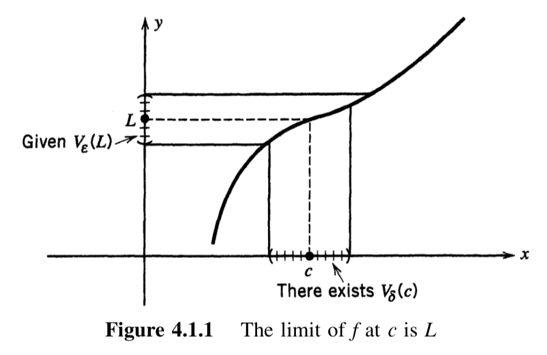

---
{"creation-time":"2025-04-28 08:58","status":"adult","tags":["content-type/conceptual","content-type/referential"],"parent":["[[limits]]"],"publish":true,"PassFrontmatter":true}
---

### Definition

- [Cluster point](#4.1.1%20Definition%20Cluster%20point)
- [Limit of a function](#4.1.4%20Definition%20Limit%20of%20a%20function)

### Theorem

Let
- $c\in \mathbb{R}$
- $A\subseteq \mathbb{R}$
- $f:A\to \mathbb{R}$
- $L\in \mathbb{R}$

Then
1. $c$ cluster point of subset of $A$ 
	- $\iff$ $\exists(a_{n}) \in A\ni\lim(a_{n})\land a_{n}\neq c, \forall n\in \mathbb{N}$
2. $c$ cluster point of $A$
	- $\implies$ $f$ have only 1 limit at $c$
	- $\lim_{x\to c} f = L$
		- $\iff$ $\forall V_{\varepsilon}(L) \exists V_{\delta}(c) \ni x\in V_{\delta}(c) \land x\neq c \implies f(x) \in V_{\delta}(L)$
		- $\iff$ $\forall(x_{n})\in A, (x_{n}) \to c, x_{n} \neq c \forall n\in \mathbb{N} \implies (f(x_{n})) \to L$
	- $\lim_{ x \to c }f\neq L$
		- $\iff$ $\exists(x_{n})\in A, x_{n}\neq c\forall n\in \mathbb{N} \ni (x_{n}) \to c \land (f(x_{n}))\not\to L$
	- $\lim_{ x \to c}f$ does not have a limit at $c$
		- $\iff$ $\exists(x_{n})\in A,x_{n}\neq c\forall n\in \mathbb{N} \ni (x_{n}) \to c \land (f(x_{n})) \text{diverges}$

---

## 4.1.1 Definition: Cluster point

> Let $A\subseteq \mathbb{R}$.
>
> A point $c\in \mathbb{R}$ is a **cluster point of $A$**
> if for every $\delta>0$ there exists at least one point $x\in A, x\neq c$
> such that $|x-c| < \delta$

This definition is rephrased in the language of neighborhoods as follows:

> A point $c\in \mathbb{R}$ is a **cluster point of $A$**
> if every $\delta$-[**neighborhood**](2.2%20Absolute%20Value%20and%20the%20Real%20Line.md#2.2.7%20Definition%20Neighborhood) $V_{\delta}(c) = (c-\delta, c+\delta)$ of $c$
> contains at least one point of $A$ distinct from $c$.

> [!TIP] Intuition
> $c$ is a cluster point of $A$ if **ANY** open interval around $c$ contains **at least one** element of $A$ (that is not $c$ itself).

For example, if $A:=\{ 1,2 \}$, then the point $1$ is not a cluster point of $A$,
since choosing $\delta:=\frac{1}{2}$ gives a neighborhood of $1$ that contains no points of $A$ distinct from $1$.

The same is true for the point $2$, so we see that $A$ has no cluster points.

See also:
- https://www.youtube.com/watch?v=McJ7RWs_trY

## 4.1.4 Definition: Limit of a function

> Let $A\subseteq \mathbb{R}$, and let $c$ be a cluster point of $A$.
>
> For a function $f:A\to \mathbb{R}$,
> $L\in R$ is said to be a **limit of $f$ at $c$** if,
>
> given any $\varepsilon >0$, there exists a $\delta(\varepsilon)>0$ such that
> if $x\in A$ and $0<|x-c|<\delta$, then $|f(x) - L| < \varepsilon$

> [!TIP] Purpose of cluster points
> Main purpose of a cluster point is that in this theorem, if $c$ is a cluster point of $A$ and $A$ is the domain of $f$ then $\lim_{x\to c}f(x)$ **must exist**.
> 
> In other words, for $f$ to have a limit, $c$ **must be a cluster point** of the domain of $f$.

> [!NOTE]  
> 1. $\delta(\varepsilon)$ means value of $\delta$ depends on $\varepsilon$
> 2. $|x-c| >0$, because $x\neq c$ per [4.1.1 Definition: Cluster point](#4.1.1%20Definition%20Cluster%20point)
> 3. We use the following to define limits:
> 	- $f(x) \to L$ as $x\to c$
> 	- $\lim_{x\to c}f(x)$
> 	- $\lim_{x \to c}f$
> 4. If $\lim_{x\to c}f(x) = L$, then we say $f$ [converges](3.1%20Sequences%20and%20Their%20Limits.md#3.1.3%20Definition%20Converging%20and%20diverging%20(limit)%20of%20a%20sequence) to $L$ at $c$
> 5. If $f$ doesn't have a limit at $c$, then we say $f$ is [divergent](3.1%20Sequences%20and%20Their%20Limits.md#3.1.3%20Definition%20Converging%20and%20diverging%20(limit)%20of%20a%20sequence) at $c$

---

## 4.1.2 Theorem

> Let $A\subseteq \mathbb{R}$
>
> A number $c\in \mathbb{R}$ is a **cluster point of a subset of $A$**
> if and only if there exists a [sequence](3.1%20Sequences%20and%20Their%20Limits.md#3.1.1%20Definition%20Sequence%20of%20real%20numbers) $(a_{n})$ in $A$
> such that for all $n\in \mathbb{N}$, $\lim(a_{n}) = c$ and $a_{n} \neq c$

## 4.1.5 Theorem

> If $f:A\to \mathbb{R}$ and if $c$ is a cluster point of $A$,
> then $f$ can have only **one limit at $c$**

> [!TIP]
> We can prove $f:A\to \mathbb{R}$ has a limit  if we can prove $c$ is a cluster point in $A$.

## 4.1.6 Theorem

> Let $f:A\to \mathbb{R}$ and let $c$ be a cluster point of $A$.
>
> Then the following statements are equivalent:
> 1. $\lim_{x\to c}f(x) = L$
> 2. Given any $\varepsilon$-neighborhood $V_{\varepsilon}(L)$ of $L$,
>    there exists $\delta$-neighborhood $V_{\delta}(c)$ of $c$
>    such that if $x\neq c$ is any point in $V_{\delta}(c)\cap A$,
>    then $f(x)$ belongs to $V_{\delta}(L)$

## 4.1.8 Theorem: Sequential criterion

> Let $f:A\to \mathbb{R}$ and let $c$ be a cluster point of $A$.
> 
> Then the following are equivalent:
> 1. $\lim_{x\to c} f = L$
> 2. For every sequence $(x_{n})$ in $A$ that converges to $c$
>    such that $x_{n}\neq c$ for all $n\in \mathbb{N}$,
>    the sequence $(f(x_{n}))$ converges to $L$

## 4.1.9 Theorem: Divergence criteria

> Let $A\subseteq \mathbb{R}$, let $f:A\to \mathbb{R}$ and let $c\in \mathbb{R}$ be a cluster point of $A$.
> 
> 1. If $L\in \mathbb{R}$, then **$f$ does not have limit $L$ at $c$** if and only if
>    there exists a sequence $(x_{n})$ in $A$ with $x_{n}\neq c \quad \forall n\in \mathbb{N}$,
>    such that the $(x_n)$ converges to $c$
>    but the $(f{(x_{n})})$ *does not converge to $L$*
>
> 2. The function **$f$ does not have a limit at $c$** if and only if
>    there exists a sequence $(x_{n})$ in $A$ with $x_{n}\neq c, \forall n\in \mathbb{N}$,
>    such that $(x_{n})$ converges to $c$
>    but the $(f(x_{n}))$ *diverges*

> [!TIP]
> Number 1 may be used to prove that $f$ does not converge ONLY to $L$ at $c$.
>
> Number 2 may be used to prove that $f$ does not have a limit at all.
