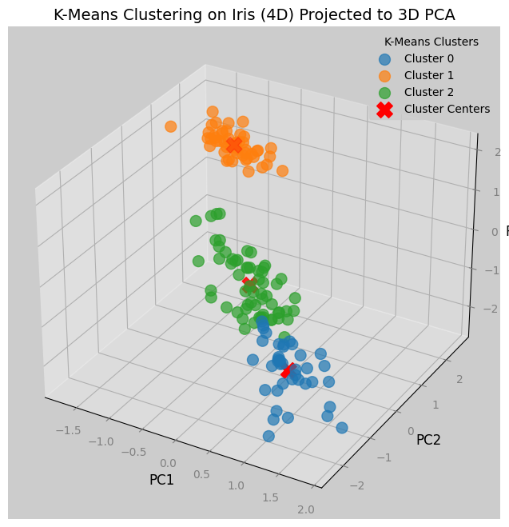
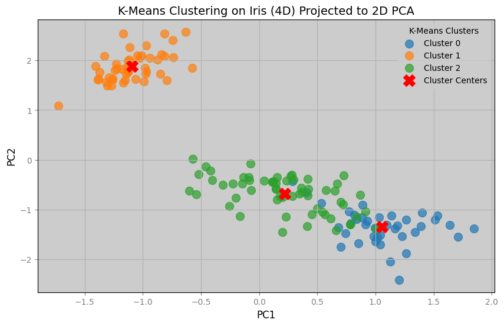

---
{"creation-time":"2025-02-20 16:07","status":"elder","tags":null,"parent":["[[multivariate analysis]]"],"publish":true,"PassFrontmatter":true}
---


## Brief intuition behind PCA

Principal Component Analysis (PCA) **transforms a dataset into a new coordinate system** where the axes—called principal components—align with the directions of maximum variance.

Imagine a cloud of data points: PCA finds the **"longest" direction the cloud stretches, then the next longest perpendicular to it, and so on**. These directions are the principal components.

By doing this, it **reorients the data such that the information are "highlighted" as much as possible**, making it easier to analyze or compress while preserving as much information as possible.

## Reason to do PCA

PCA is employed to simplify data without losing its essence. In high-dimensional datasets, features often overlap or contain noise, making analysis cumbersome.

PCA reduces this complexity by projecting the data onto a smaller set of principal components that retain the majority of the information (variance).

This reduction is valuable for 
- **Visualization** (e.g., plotting 2D views of 100D data)
- **Speeding up computations** (fewer dimensions mean less processing)
- **Improving model performance** (reducing the amount of compuattion required for the model to think)

## PCA compuatation

### 1: Center the data

Centering the data shifts its mean to zero. Without this step, variance calculations could be skewed by the data’s absolute position rather than its spread, undermining PCA’s goal of finding directions of maximum variability.

For a dataset $\mathbf{Y}$ with $n$ samples and $p$ features:  

1. **Sample mean**
	Compute the mean vector $\mathbf{\bar{Y}}$ across all samples for each feature:  
	$$\mathbf{\bar{Y}} = \frac{1}{n} \sum_{i=1}^{n} \mathbf{Y}_i$$  
	where $\mathbf{Y}_i$ represents the $i$-th sample.  

2. **Centering**
	Subtract $\mathbf{\bar{Y}}$ from each sample to obtain the centered data $\mathbf{Y}_{\text{centered}}$:  
	$$\mathbf{Y}_{\text{centered}} = \mathbf{Y} - \mathbf{\bar{Y}}$$  

This ensures each feature’s mean is zero in $\mathbf{Y}_{\text{centered}}$, setting the stage for PCA to analyze variance purely based on data dispersion.

### 2: Compute the sample covariance matrix

With the data centered, computing the covariance matrix captures how features vary together. This step quantifies relationships between variables, providing PCA with the structure needed to identify the most significant directions of spread.

- **Sample covariance matrix**:
	$$\mathbf{S} = \frac{1}{n-1} \mathbf{Y}_{\text{centered}}^T \mathbf{Y}_{\text{centered}}$$  

This matrix serves as the allows PCA to extract principal directions of variance.

### 3: Eigen decomposition

Eigen decomposition breaks down the covariance matrix into its core components—eigenvalues and eigenvectors.

This step is crucial for PCA because it provides the optimal axes—eigenvectors—that has maximum variance.

- **Eigen decomposition**
	$$\mathbf{S} = \mathbf{C} \boldsymbol{\Lambda} \mathbf{C}^T$$  
	where $\boldsymbol{\Lambda} = \text{diag}(\lambda_1, \lambda_2, \dots, \lambda_p)$ contains the eigenvalues, and $\mathbf{C}$ has eigenvectors as columns.  
	
	Each column of $\mathbf{C}$ is an **eigenvector**. PCA uses these as the principal components—new axes that capture the data’s spread.
	
	**Eigenvalues $\lambda_i$ quantify the variance along each eigenvector**, and $\mathbf{C}$ is orthogonal ($\mathbf{C}^T \mathbf{C} = \mathbf{I}$).
	
	**Orthogonality ensures the principal components are independent** (uncorrelated), a key property for PCA to separate variance contributions cleanly—without it, overlapping directions would disturb the analysis.
	

This step identifies all possible principal components, setting up the prioritization process.

### 4: Sort eigenvalues and eigenvectors

Sorting the eigenvalues and eigenvectors orders the principal components by importance in context of PCA.

This ensures PCA focuses on **directions with the largest variance first**, aligning with its objective of efficient dimensionality reduction.

For the eigenvalues $\boldsymbol{\lambda}$ and eigenvectors $\mathbf{C}$, arrange the eigenvalues in descending order ($\lambda_1 \geq \lambda_2 \geq \dots \geq \lambda_p$) and reorder the corresponding eigenvectors in $\mathbf{C}$ accordingly.  

### 5: Rotate the axes to principal components

Rotating the data onto the principal components transforms it into a new coordinate system.

This final step aligns the data with the directions of maximum variance.

1. Use the sorted $\mathbf{C}$ (or its transpose $\mathbf{A} = \mathbf{C}^T$) where each column of $\mathbf{C}$ is a principal component direction.  
2. Project the centered data onto these directions to obtain the transformed data $\mathbf{Z}$
   $$\mathbf{Z} = \mathbf{Y}_{\text{centered}} \mathbf{C}$$  
   where $\mathbf{Z}$ is an $n \times p$ matrix of principal component scores.


## Python example

In this section we will demonstrate a PCA process and its application using the Python programming language.

The goal here is to visualize a multi-dimensional dataset into a lower-dimension plots for visualization.

### 0. Setup

We will demonstrate PCA in Python using [load_iris()](https://scikit-learn.org/stable/modules/generated/sklearn.datasets.load_iris.html) method from [scikit-learn](https://scikit-learn.org/) library.

The data has 4 variables with 150 observations.

```python title:Setup fold
import numpy as np
import matplotlib.pyplot as plt
from sklearn.datasets import load_iris
from sklearn.cluster import KMeans


iris = load_iris()
Y = iris.data  # 4D: sepal length, sepal width, petal length, petal width

print(f"\nDataset shape: {Y.shape}")
print(f"\nFeature names: {iris.feature_names}")
print("\nFirst 3 samples:\n", Y[:3, :])
```

Output
```
Dataset shape: (150, 4)

Feature names: ['sepal length (cm)', 'sepal width (cm)', 'petal length (cm)', 'petal width (cm)']

First 3 samples:
 [[5.1 3.5 1.4 0.2]
 [4.9 3.  1.4 0.2]
 [4.7 3.2 1.3 0.2]]
```

### 1. PCA computation

Next we will compute the principal components based on [[3 Reference/Principal Component Analysis#PCA analysis\|#PCA analysis]] section.


```python title:"PCA computation" fold
# 1. Center the data
Y_bar = np.mean(Y, axis=0)
Y_i = Y - Y_bar

# 2. Compute the sample covariance matrix
S = np.cov(Y_i, rowvar=False)

# 3. Eigen decomposition
lambdas, C = np.linalg.eigh(S)

# 4. Sort eigenvalues and eigenvectors.
sorted_idx = np.argsort(lambdas)[::-1]
lambdas = lambdas[sorted_idx]
C = C[:, sorted_idx]

# 5. Rotate the axes to the principal components
A = C.T
Z = np.dot(Y_i, A)
```
### 2. Reduce the dimensions

Since we want to visualize a 2d and 3d plot from our 4d data, we will chose eigenvectors with the highest eigenvalues for our new axis in 2d and 3d.

The observations can then be projected into the new space.

```python title:"Reduce the dimensions" fold
# Project to "top 2" principal components by their eigenvalues
Z_2d = Z[:, :2]

# Project to "top 3" principal components by their eigenvalues
Z_3d = Z[:, :3]

print("2d shape: ", Z_2d.shape)
print("3d shape: ", Z_3d.shape)

# Compute cumulative proportion of eigenvalues
cml_prop = np.cumsum(lambdas) /  np.sum(lambdas)
print(lambdas)
print(cml_prop)
```

Output

```
2d shape:  (150, 2)
3d shape:  (150, 3)
[4.22824171 0.24267075 0.0782095  0.02383509]
[0.92461872 0.97768521 0.99478782 1.        ]
```

We can see from the output that the top 2 eigenvalues already explain $97.7\%$ of the variance in the data. The top 3 explains $99.4\%$.

### 3. Visualize the result

We can see from the plots below that we have successfully reduced the dimensions of a dataset for visualization.

Notice from the 2d graph that there are blue dots that by K-Means clustering should belong to green dots, and vice versa.

Since the clustering was done in 4 dimensions, the cause of the mismatched are due to the information lost in the reduction of dimensions.




```python title=Code
clusters = 3
kmeans = KMeans(n_clusters=clusters, random_state=42)
kmeans.fit(Y)
labels = kmeans.labels_
centers = np.dot(kmeans.cluster_centers_ - Y_bar, A)
centers_2d = centers[:, :2]
centers_3d = centers[:, :3]

print(f"{clusters=}")

plt.figure(figsize=(10, 6))
for cluster in range(clusters):
    cluster_points = Z_2d[labels == cluster]
    plt.scatter(cluster_points[:, 0], cluster_points[:, 1], s=100, alpha=0.7, label=f"Cluster {cluster}")
plt.scatter(centers_2d[:, 0], centers_2d[:, 1], c="red", s=200, marker="X", label="Cluster Centers")
plt.title("K-Means Clustering on Iris (4D) Projected to 2D PCA", fontsize=14, color='black')
plt.xlabel("PC1", fontsize=12, color='black')
plt.ylabel("PC2", fontsize=12, color='black')
plt.legend(title="K-Means Clusters")
plt.grid(True)
plt.savefig(f"kmeans_{Y.shape[1]}d_pca_2d.png")

fig = plt.figure(figsize=(10, 8))
ax = fig.add_subplot(111, projection='3d')
for cluster in range(clusters):
    cluster_points = Z_3d[labels == cluster]
    ax.scatter(cluster_points[:, 0], cluster_points[:, 1], cluster_points[:, 2], 
               s=100, alpha=0.7, label=f"Cluster {cluster}")
ax.scatter(centers_3d[:, 0], centers_3d[:, 1], centers_3d[:, 2], 
           c='red', s=200, marker='X', label='Cluster Centers')
ax.set_title("K-Means Clustering on Iris (4D) Projected to 3D PCA", fontsize=14, color='black')
ax.set_xlabel("PC1", fontsize=12, color='black')
ax.set_ylabel("PC2", fontsize=12, color='black')
ax.set_zlabel("PC3", fontsize=12, color='black')
ax.legend(title="K-Means Clusters")
plt.savefig(f"kmeans_{Y.shape[1]}d_pca_3d.png")
```
