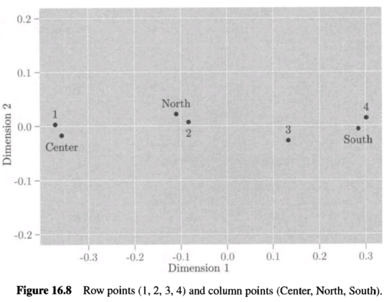
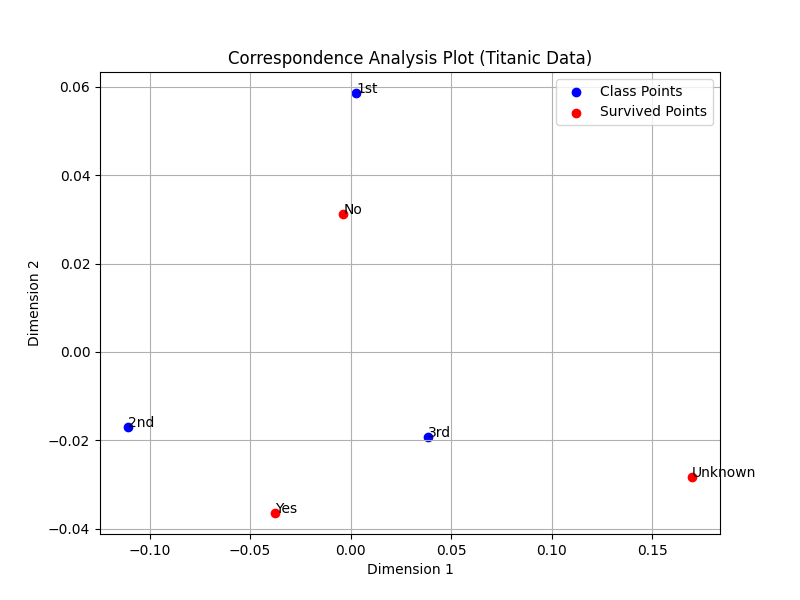

---
{"creation-time":"2025-05-09 12:24","status":"baby","tags":["content-type/combined"],"parent":["[[multivariate analysis]]"],"publish":true,"PassFrontmatter":true}
---

## About correspondence analysis

Correspondence analysis is a graphical technique to visualize relationships in a two-way contingency table with counts of two categorical variables.

The goal is to create a **2D plot showing interactions between variables and similarities among rows and columns**, aiding in identifying associations or categories for combination when chi-square tests fail due to small frequencies.

For example, correspondence plot in [Code output and interpretation](#Code%20output%20and%20interpretation) shows 1st class positioned close to "No" and 2nd and 3rd class near "Yes,". This suggests that 1st class passengers had lower survival rates, while 2nd and 3rd class passengers were more likely to survive.

## Data on Correspondence Analysis

The data matrix for correspondence analysis is a two-way contingency table with $a$ rows and $b$ columns, containing counts $n_{ij}$ representing the frequency of occurrences for each combination of two categorical variables.

$$
\begin{array}{c|cccc|c}
 & 1 & 2 & \cdots & b & \text{Row Total} \\
\hline
1 & n_{11} & n_{12} & \cdots & n_{1b} & n_{1.} \\
2 & n_{21} & n_{22} & \cdots & n_{2b} & n_{2.} \\
\vdots & \vdots & \vdots & \ddots & \vdots & \vdots \\
a & n_{a1} & n_{a2} & \cdots & n_{ab} & n_{a.} \\
\hline
\text{Column Total} & n_{.1} & n_{.2} & \cdots & n_{.b} & n \\
\end{array}
$$

### Variables

- Rows: Represent the first categorical variable with $a$ categories.
- Columns: Represent the second categorical variable with $b$ categories.
- $n_{ij}$ (Cells): Frequency of occurrences where row category $i$ intersects with column category $j$.
- $n_{i.}=\sum_{j=1}^b n_{ij}$ (Row Totals): Sum of frequencies for row $i$.
- $n_{.j}=\sum_{i=1}^a n_{ij}$ (Column Totals): Sum of frequencies for column $j$.
- $n=\sum_{i,j} n_{ij}$ (Grand Total): Total frequency across all cells.

### Transformations

- $\mathbf{P}$ (Correspondence Matrix): Converts counts to relative frequencies
$$p_{ij}=n_{ij}/n$$
- $\mathbf{r}_i^{\prime}$ (Row Profiles): Distribution across columns for row $i$.
$$(p_{i1}/p_{i.}, \ldots, p_{ib}/p_{i.})$$
- $\mathbf{c}_j$ (Column Profiles): Distribution across rows for column $j$.
$$(p_{1j}/p_{.j}, \ldots, p_{aj}/p_{.j})^{\prime}$$
- Multiple Correspondence Analysis: Uses indicator matrix $\mathbf{G}$ (rows = items, columns = categories) with 0s and 1s, analyzed via Burt matrix $\mathbf{G}^{\prime}\mathbf{G}$.

## Computing row and column profiles

1. Convert contingency table frequencies $n_{ij}$ to relative frequencies $p_{ij}=n_{ij}/n$, forming the correspondence matrix $\mathbf{P}$.
2. Calculate row sums $p_{i.}=\sum_{j=1}^b p_{ij}$ as vector $\mathbf{r}$ and column sums $p_{.j}=\sum_{i=1}^a p_{ij}$ as vector $\mathbf{c}^{\prime}$.
3. Derive row profile $\mathbf{r}_i^{\prime}=(p_{i1}/p_{i.}, \ldots, p_{ib}/p_{i.})$ by dividing each row of $\mathbf{P}$ by $p_{i.}$.
4. Derive column profile $\mathbf{c}_j=(p_{1j}/p_{.j}, \ldots, p_{aj}/p_{.j})^{\prime}$ by dividing each column of $\mathbf{P}$ by $p_{.j}$.

## Computing coordinates for plotting

1. Compute $\mathbf{Z}=\mathbf{D}_r^{-1/2}(\mathbf{P}-\mathbf{r}\mathbf{c}^{\prime})\mathbf{D}_c^{-1/2}$, where $\mathbf{D}_r$ and $\mathbf{D}_c$ are diagonal matrices of $\mathbf{r}$ and $\mathbf{c}$.
2. Perform singular value decomposition $\mathbf{Z}=\mathbf{U}\mathbf{\Lambda}\mathbf{V}^{\prime}$, with $\mathbf{\Lambda}=\operatorname{diag}(\lambda_1, \ldots, \lambda_k)$.
3. Calculate row coordinates $\mathbf{X}=\mathbf{D}_r^{-1}\mathbf{A}\mathbf{\Lambda}$, where $\mathbf{A}=\mathbf{D}_r^{1/2}\mathbf{U}$.
4. Calculate column coordinates $\mathbf{Y}=\mathbf{D}_c^{-1}\mathbf{B}\mathbf{\Lambda}$, where $\mathbf{B}=\mathbf{D}_c^{1/2}\mathbf{V}$.
5. Use the **first two columns of $\mathbf{X}$ and $\mathbf{Y}$ for 2D plotting**, first three for 3D, and so on.

## Evaluating model performance

1. Test independence with chi-square statistic [Formula 16.25](#Core%20Formulas): $\chi^2=n\sum_{i=1}^a\sum_{j=1}^b (p_{ij}-p_{i.}p_{.j})^2/(p_{i.}p_{.j})$.
2. Compute total inertia as $\chi^2/n=\sum_{i=1}^k \lambda_i^2$ [Formula 16.46](#Core%20Formulas).
3. Assess dimension contribution with $(\lambda_1^2+\lambda_2^2)/\sum_{i=1}^k \lambda_i^2$ [Formula 16.47](#Core%20Formulas).
4. Verify rank $k=\min(a-1, b-1)$ for data representation.

## Interpreting the results

- Close row points indicate similar row profiles
- Close column points suggest similar column profiles
- Close row and column points indicates that specific row-column category combination occurs more frequently than expected if the two variables were independent.

#TODO Improve the 2 paragraphs below

A row profile shows a row’s column category distribution, summing to 1. Similar row profiles, like 1st and 2nd class with high "Yes" rates in [Python Example](#Python%20Example), mean similar column patterns, placing their points close in the plot.

A column profile shows a column’s row category distribution, summing to 1. Similar column profiles, like "Yes" and "Unknown" with more 1st class, mean similar row patterns, positioning their points near each other in the plot.



Inertia and chi-square ($p$-value) indicate association strength; high inertia in the first two dimensions (e.g., >80%) suggests a good 2D fit.

## Assumptions

- Adequate cell frequencies for chi-square.
#TODO improve
- Independence testable via $p_{ij}=p_{i.}p_{.j}$ or chi square as in [Evaluating model performance](#Evaluating%20model%20performance).
- Two-dimensional projection preserves key relationships.

## Core formulas

- Formula 16.25 (Chi-square test): $$\chi^2=n\sum_{i=1}^a\sum_{j=1}^b \frac{(p_{ij}-p_{i.}p_{.j})^2}{p_{i.}p_{.j}}$$ 
- Formula 16.46 (Total inertia): $$\frac{\chi^2}{n}=\sum_{i=1}^k \lambda_i^2$$ 
- Formula 16.47 (Dimension contribution): $$\frac{\lambda_1^2+\lambda_2^2}{\sum_{i=1}^k \lambda_i^2}$$ 

## Limitations

- Small or zero frequencies weaken chi-square approximation.
- Two-dimensional plot may lose higher-order information.
- Assumes linear relationships in projected space.
- Multiple correspondence analysis excludes higher-order interactions.

## Python Example

### Code

```python
p
import pandas as pd
import matplotlib.pyplot as plt

# 1. Synthetic Titanic passenger data (common dataset)
np.random.seed(42)
n = 891  # Approximate number of passengers in Titanic dataset
data = {
    'Class': np.random.choice(['1st', '2nd', '3rd'], size=n, p=[0.24, 0.21, 0.55]),
    'Survived': np.random.choice(['Yes', 'No', 'Unknown'], size=n, p=[0.38, 0.52, 0.10]),  # Added category
    'Count': np.random.randint(1, 10, size=n)  # Simulated counts
}
df = pd.DataFrame(data)

# 2. Create contingency table
contingency_table = pd.crosstab(df['Class'], df['Survived'], values=df['Count'], aggfunc='sum').fillna(0)
n_ij = contingency_table.values
a, b = contingency_table.shape
n = np.sum(n_ij)

# 3. Compute correspondence matrix P
P = n_ij / n

# 4. Compute row and column profiles
row_sums = np.sum(P, axis=1)
col_sums = np.sum(P, axis=0)
r = row_sums
c = col_sums

row_profiles = P / row_sums[:, np.newaxis]
col_profiles = P / col_sums[np.newaxis, :]

# 5. Compute chi-square statistic
chi2 = n * np.sum(((P - np.outer(r, c))**2) / (np.outer(r, c)))
print(f"Chi-square statistic: {chi2:.4f}")

# 6. Compute Z matrix and SVD for coordinates
D_r = np.diag(r)
D_c = np.diag(c)
Z = np.dot(np.diag(1 / np.sqrt(r)), (P - np.outer(r, c)))
Z = np.dot(Z, np.diag(1 / np.sqrt(c)))

U, s, Vt = np.linalg.svd(Z)
k = min(a - 1, b - 1)  # Now k = min(3-1, 3-1) = 2
Lambda = np.diag(s[:k])
A = np.dot(np.diag(np.sqrt(r)), U[:, :k])
B = np.dot(np.diag(np.sqrt(c)), Vt.T[:, :k])

X = np.dot(np.diag(1 / r), A) @ Lambda
Y = np.dot(np.diag(1 / c), B) @ Lambda

# 7. Plot first two dimensions
plt.figure(figsize=(8, 6))
plt.scatter(X[:, 0], X[:, 1], label='Class Points', color='blue')
plt.scatter(Y[:, 0], Y[:, 1], label='Survived Points', color='red')
for i, txt in enumerate(contingency_table.index):
    plt.annotate(txt, (X[i, 0], X[i, 1]))
for j, txt in enumerate(contingency_table.columns):
    plt.annotate(txt, (Y[j, 0], Y[j, 1]))
plt.xlabel('Dimension 1')
plt.ylabel('Dimension 2')
plt.title('Correspondence Analysis Plot (Titanic Data)')
plt.legend()
plt.grid(True)
plt.savefig('correspondence_analysis_titanic_plot.png')
plt.close()

print("Class Coordinates (first two dimensions):")
print(X[:, :2])
print("Survived Coordinates (first two dimensions):")
print(Y[:, :2])
```

### Code output and interpretation

```
Chi-square statistic: 19.4526
Class Coordinates (first two dimensions):
[[ 0.00285991  0.05857428]
 [-0.11061234 -0.01688138]
 [ 0.03834242 -0.01931798]]
Survived Coordinates (first two dimensions):
[[-0.00365061  0.0313022 ]
 [ 0.16964827 -0.02834648]
 [-0.03743458 -0.0364378 ]]
```

Chi-square Statistic (19.4526, $p$-value < 0.001) indicates a moderate association between class and survival status in the Titanic data. It also indicates dependence, **implying survival varies across passenger classes** beyond random chance.



Proximity in the plot (e.g., 1st class near "No") suggests lower survival for 1st class passengers, while 2nd and 3rd class near "Yes" indicates higher survival. 