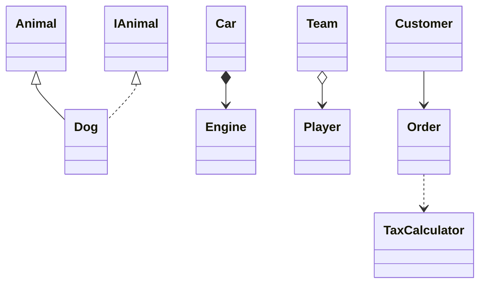

## UML Relationships

### Visual Notation

| Relationship    | Notation                          | Mermaid                |
| --------------- | --------------------------------- | ---------------------- |
| **Association** | Simple arrow                      | `A --> B`              |
| **Dependency**  | Simple arrow, dashed line         | `A ..> B`              |
| **Aggregation** | Simple arrow, empty diamond back  | `A o--> B`             |
| **Composition** | Simple arrow, filled diamond back | `A *--> B`             |
| **Inheritance** | Empty triangle head               | <code>A --|> B</code> |
| **Realization** | Empty triangle head, dashed line  | <code>A ..|> B</code> |

### Relationship Reference

| Relationship    | Question                                  | Example               | Key Property                                      |
| --------------- | ----------------------------------------- | --------------------- | ------------------------------------------------- |
| **Association** | "Does A use/know B?"                      | Customer → Order      | A holds a reference to B                          |
| **Dependency**  | "Does A temporarily use B?"               | Order → TaxCalculator | B appears only in method param/return, not stored |
| **Aggregation** | "Does A have B, but B can exist alone?"   | Team → Player         | A contains B; B has independent lifecycle         |
| **Composition** | "Does A own B, and B cannot exist alone?" | Car → Engine          | B's lifecycle is bound to A                       |
| **Inheritance** | "Is A a B?"                               | Dog → Animal          | A is a subtype of B                               |
| **Realization** | "Does A implement interface B?"           | Dog → IAnimal         | A fulfills the contract defined by B              |

### Notes

- **Composition vs Aggregation**: Both use diamond notation. The difference is lifecycle
  - Composition: The contained object <u>cannot exist</u> without the container.
  - Aggregation: It can.
- **Association vs Dependency**:
  - Association: Implies a <u>persistent</u> reference (field)
  - Dependency: Implies a <u>transient</u> use (local variable, parameter).
- **Aggregation** vs **Association**:
  - Aggregation: Requires "whole-part" or "has-a" relationship, e.g., University aggegates Department. Car aggregates Wheel. An object that uses another object as a "tool" or "utility" is not aggregating that object.
  - Association: otherwise
- **Inheritance vs Realization**: Inheritance is class→class. Realization is class→interface.
- **Abstract class**: Name written in _italic_ in diagrams.
- **`<<extend>>` / `<<include>>`**: These are use case diagram relationships, not class diagram relationships. Do not confuse with Inheritance/Realization.

### Mermaid Example

