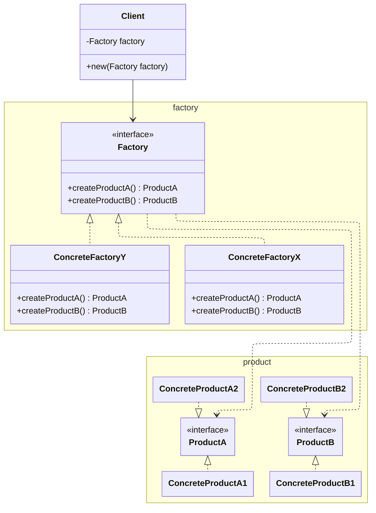

Suppose we have different kind of furnitures: Chair, Table, Bed. Each furniture with different variants: Art Deco, Victorian, Modern.

Usually clients wants to buy different furnitures but from one variant only.

**Abstract Factory** is an "extension" of [[factory-method_202605121919|Factory Method]] that allows us to <u>group factory method of the same variants of Products in one place</u>.

With **Abstract Factory**, clients can choose a factory that can produce different furnitures but only for one variant - each factories "group" different furnitures for a variant.

## Structure

## Notes

use this often in repositories/data layer. I have a `Repository` for each table in our db, and we want to aggregate all repository for a single data backend in one interface. I aggregate it to `Repositories`, which in this pattern is a `Factory` of `Repository`. For an sqlite database, it'd be `SqliteRepositories`

If we want to add more data backends such as S3, I can create another object that implements `Repositories`, such as `S3Repositories`
