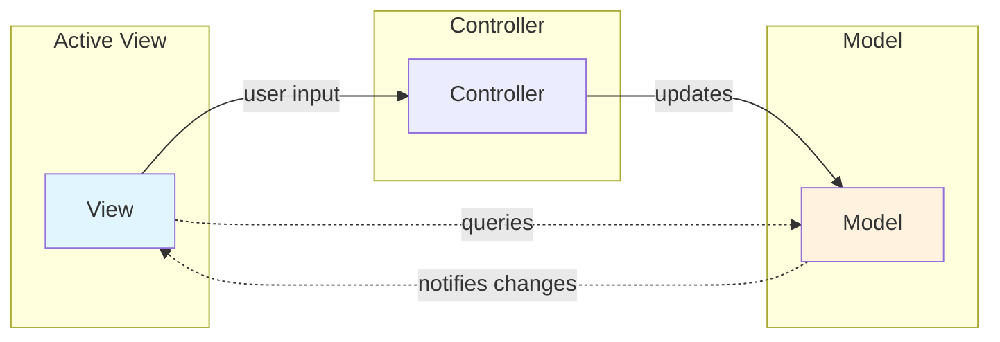

## Definition

**Active View** is a View variant in MVC where the View observes the Model directly for changes and queries the Model for updated data. The Controller only handles input events.

## Key Characteristics

- **Direct Model Access**: View queries Model for data
- **Observation Pattern**: View observes Model changes automatically
- **Lightweight Controller**: Controller only handles input routing
- **Reactive**: View updates automatically when Model changes

## Comparison

| Aspect | Passive View | Active View |
|--------|--------------|-------------|
| Data Source | Controller only | Model directly |
| Model Awareness | None | Observes Model |
| Controller Role | Input + Data formatting | Input only |
| Testability | Higher (full mediation) | Lower (Model coupling) |

## Implementation Patterns

- **Observer Pattern**: View registers as observer of Model
- **Event Bus**: View subscribes to Model change events
- **Reactive Streams**: View binds to Model data streams

## Advantages

1. <u>More responsive</u> — View updates immediately when Model changes
2. Controller stays lightweight
3. Enables real-time data synchronization

## Disadvantages

1. Tighter coupling between View and Model
2. View tests need Model mocking
3. Harder to reason about data flow

## Related

- [[3 Reference/mvc-(model-view-controller)_202604091518\|MVC (Model View Controller)]]
- [[3 Reference/passive-view_202604091522\|Passive View]]