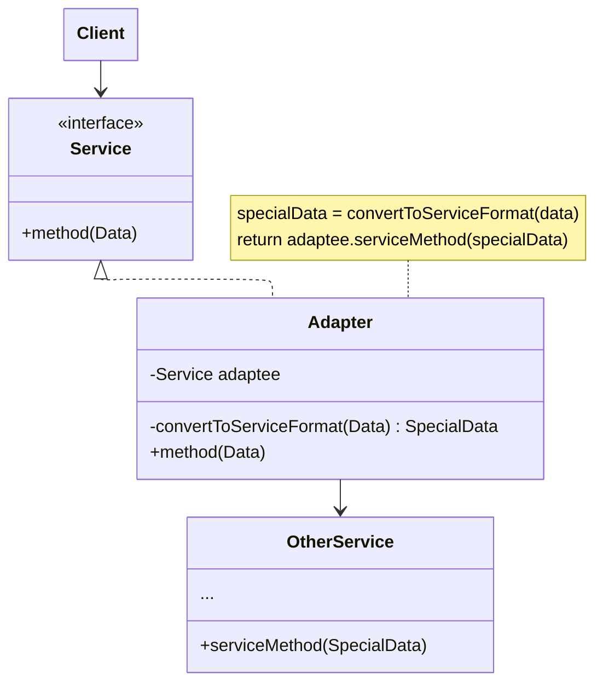
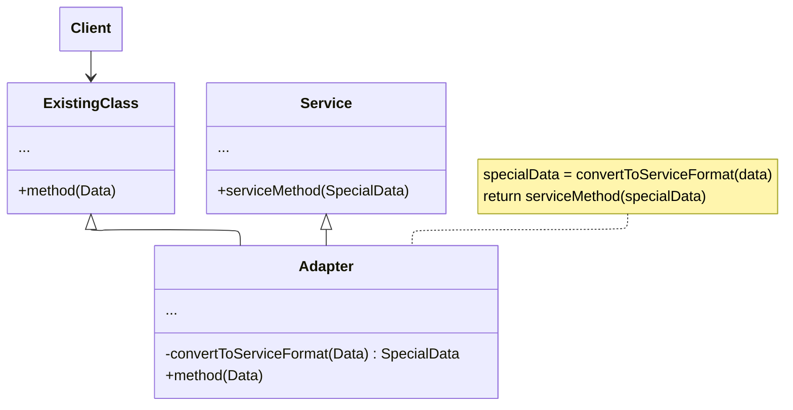

Object that converts an object's interface to another.

Why not call a helper method directly? This pattern is useful when our client code depends an interface, not a concrete type.

By creating an adapter to that interface, we can accept different types of data.

```rust
impl ClientInterface for Adapter {
    fn display_profile(&self, user: User) { ... }
}

impl ClientInterface for LegacyAdapter {
    fn display_profile(&self, user: LegacyUser) { ... } // different source type, same interface
}
```

The client just holds a `&dyn ClientInterface` and doesn't care which adapter is behind it. Calling a helper directly couples the client to both the data type and the transformation logic.

## Approaches

https://refactoring.guru/design-patterns/adapter introduces two approaches for implementing this design pattern:

### Object adapter

Uses <u>composition</u>: Implements the interface of one object and wraps the other one



### Class adapter

Uses <u>inheritance</u>: Inherits interface from both objects at once.


