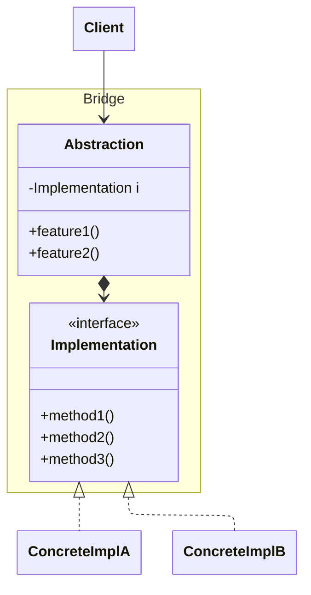

![[assets/bridge-design-pattern_202606031149-1780462222837.webp]]

The purpose of this pattern is to decouple client code from implementation, by providing a "**bridge**" between them. The client interacts calls <u>implementation</u> abstractly through the <u>abstraction</u> as a bridge.

This is useful when the "concept" being abstracted has different implementations.

For example, UI code across different platforms. In this case, the <u>implementation</u> is the concrete UI backends, and the <u>abstraction</u> is the UI display logic, which calls the implementation.

## Structure

