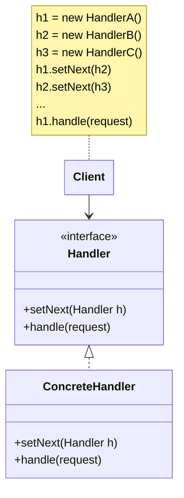

This pattern can be used when you need to send _commands_ to a _chain_ of _handlers_ in a particular order. Each handler decides whether it consumes the command, or passes it to the next handler.

For example, passing an user request to a chain of request handlers, such as auth, validation, caching, security etc.

## Structure

