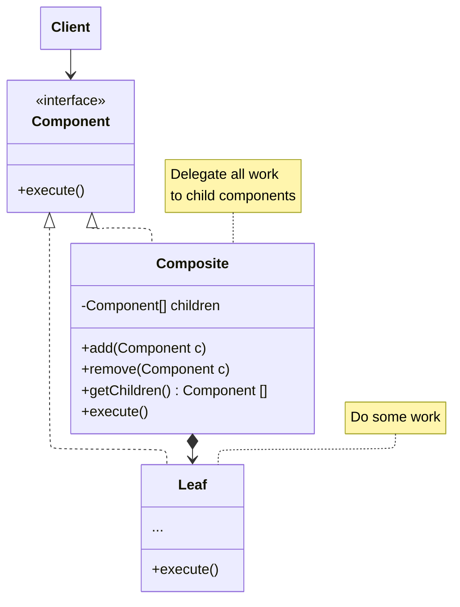

Compose objects into tree structures and then work with these structures as if they were individual objects.

For example, using `Guild::message` to send message to each `GuildMember::message` in that guild through a trait `Messageable`.

## Structure

