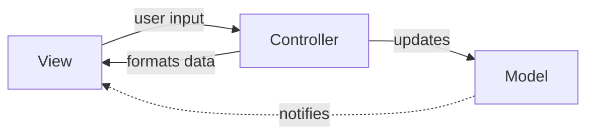

## Definition

The **Controller** is the translator component in MVC and MVC-C patterns. It handles user input from the View and updates the Model accordingly.

## Responsibilities

- **Input Handling**: Receives and processes user input from View
- **Model Updates**: Modifies Model based on user actions
- **View Updates**: Formats and provides data to View (in some variants)

## Controller Behavior by Variant

| Variant | Controller Role | View Dependency |
|---------|----------------|-----------------|
| MVC (Passive View) | Handles input + formats View data | View queries Controller |
| MVC (Active View) | Handles input only | View observes Model |
| MVC-C | Same + delegates navigation to Coordinator | Same |

## Key Characteristics

- **Action-Oriented**: Responds to user actions/events
- **Mediator**: Ensures View and Model don't communicate directly
- **Stateless**: Ideally holds no state (state lives in Model)

> [!WARNING] Controller Bloat
> Controllers can become bloated as application complexity grows. Consider:
> - Extracting logic to services/use cases
> - Using [[3 Reference/coordinator_202604091522\|Coordinator]] for navigation
> - Splitting into multiple Controllers

## Comparison with Other Translators

| Component | Focus | Data Flow |
|-----------|-------|-----------|
| Controller | Input handling | User → Controller → Model |
| Presenter | View formatting | Model → Presenter → View |
| ViewModel | State binding | Model ↔ ViewModel ↔ View |

## Related

- [[3 Reference/mvc-(model-view-controller)_202604091518\|MVC (Model View Controller)]]
- [[3 Reference/mvc-c-(model-view-controller-coordinator)_202604091519\|MVC-C (Model View Controller Coordinator)]]
- [[3 Reference/presenter_202604091521\|Presenter]]
- [[3 Reference/viewmodel_202604091521\|ViewModel]]