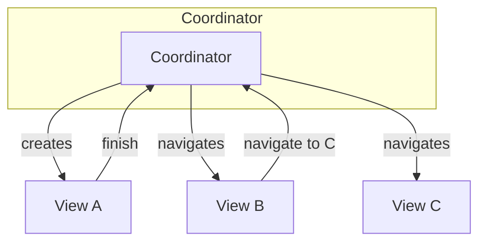
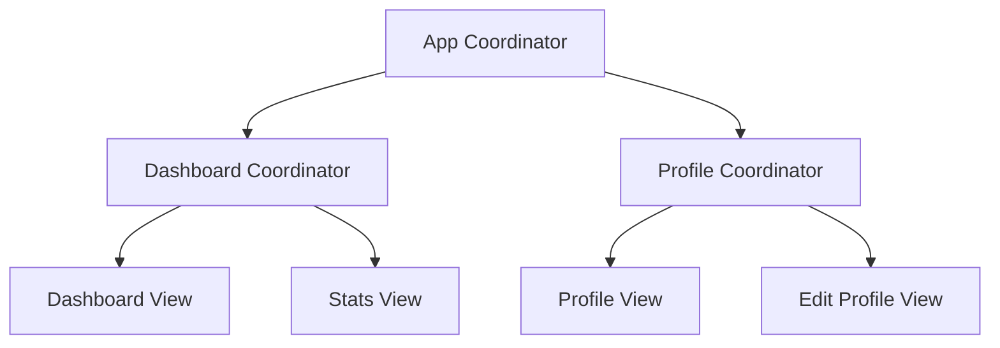

## Definition

The **Coordinator** (also called Router) is a component that handles navigation and screen flow in MVVM-C and MVC-C patterns. It separates navigation logic from ViewModels and Controllers.



## Responsibilities

- **Navigation Management**: Controls screen transitions and navigation stack
- **View Creation**: Creates and configures new Views/ViewControllers
- **Deep Linking**: Handles external URLs and navigation requests
- **Coordination**: Coordinates between multiple ViewModels/Controllers
- **Flow Control**: Manages conditional navigation (e.g., auth-gated flows)

## Key Characteristics

- **Single Responsibility**: Only handles navigation
- **Decoupled Navigation**: ViewModels/Controllers don't know about other screens
- **Testable**: Navigation logic can be tested independently
- **Composable**: Screens can be reused in different navigation flows

> [!TIP] When to Use Coordinator
> Use Coordinator pattern when:
> - Navigation flows become complex
> - Multiple ViewModels need to coordinate
> - Deep linking is required
> - A/B testing different flows

## Coordinator in Different Patterns

| Pattern | Coordinator Role |
|---------|------------------|
| MVVM-C | Delegates navigation from ViewModel to Coordinator |
| MVC-C | Delegates navigation from Controller to Coordinator |
| VIPER | Router component acts as Coordinator |

## Common Implementations

```typescript
// Coordinator example (pseudo-code)
class AppCoordinator {
  private navigationStack: NavigationStack
  
  fun showDashboard() {
    val vm = DashboardViewModel()
    val view = DashboardView(viewModel: vm)
    navigationStack.push(view)
  }
  
  fun showProfile(userId: String) {
    val vm = ProfileViewModel(userId: userId)
    val view = ProfileView(viewModel: vm)
    navigationStack.push(view)
  }
}
```

## Child Coordinators

Coordinators can have child coordinators for nested navigation flows:



## Related

- [[3 Reference/mvvm-c-(model-view-viewmodel-controller)_202604091519\|MVVM-C (Model View ViewModel Controller)]]
- [[3 Reference/mvc-c-(model-view-controller-coordinator)_202604091519\|MVC-C (Model View Controller Coordinator)]]
- [[3 Reference/viper_202604091519\|VIPER]] (Router component)