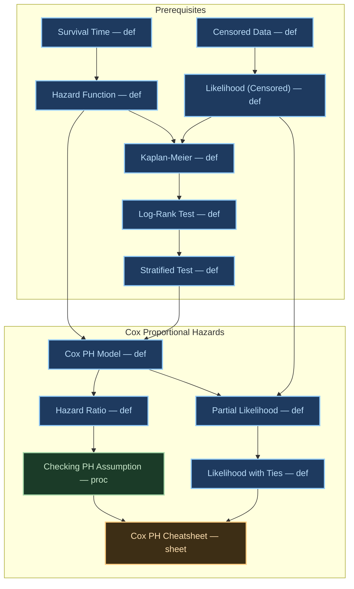

## Definition

The **Cox Proportional Hazards (Cox-PH) Model** is a semiparametric regression model for survival data that <u>relates hazard to covariates</u> (the $x_{i}$s) without assuming a distribution for the baseline hazard.

**Model:**

$h(t, \mathbf{x}) = h_0(t) \exp(\beta_1 x_1 + \cdots + \beta_P x_P) = h_0(t) e^{\boldsymbol{\beta}'\mathbf{x}}$

In linear form:
$\log\,h(t, \mathbf{x}) = \log\,h_0(t) + \beta_1 x_1 + \cdots + \beta_P x_P$

where:

- $h_0(t)$ : **baseline hazard** — the [[def-hazard-function_202603281500|hazard]] when all covariates equal 0 (or reference level). This is a function of time $t$ only.
- $\boldsymbol{\beta} = (\beta_1, \ldots, \beta_P)$ : **regression coefficients**, each $\beta_j$ corresponds to covariate $x_j$
- $\mathbf{x} = (x_1, \ldots, x_P)$ : vector of covariates (can be categorical or numeric)

## Semiparametric Nature

The model splits into two components:

| Component | Nature | Description |
|-----------|--------|-------------|
| $h_0(t)$ | **Non-parametric** | Distribution ignored — no parametric form assumed |
| $e^{\boldsymbol{\beta}'\mathbf{x}}$ | **Parametric** | Parameters $\beta_j$ estimated from data |

The model is **semiparametric** because it contains both a non-parametric part ($h_0(t)$) and a parametric part (the covariate contribution). $h_0(t)$ is treated as a **nuisance parameter** — inference focuses on $\boldsymbol{\beta}$.

## Why "Proportional Hazards"?

For two subjects A and B with covariate vectors $\mathbf{x}_A$ and $\mathbf{x}_B$:

$\frac{h(t, \mathbf{x}_B)}{h(t, \mathbf{x}_A)} = \frac{h_0(t) e^{\boldsymbol{\beta}'\mathbf{x}_B}}{h_0(t) e^{\boldsymbol{\beta}'\mathbf{x}_A}} = e^{\boldsymbol{\beta}'(\mathbf{x}_B - \mathbf{x}_A)}$

The **hazard ratio (HR)** is **constant over time** — it depends only on the difference in covariates, not on $t$. This is the **proportional hazards assumption**.

## Covariate Types

$h(t, \mathbf{x}) = h_0(t) e^{\beta_1 x_1 + \cdots + \beta_P x_P}$

- **Numeric**: $x_j$ enters directly (e.g., age, dose). Higher-order terms (e.g., $x^2$) can be added.
- **Categorical**: Dummy variables required. For $L$ categories, $L-1$ dummy variables with one category as reference.

### Dummy Variable Construction

For a categorical variable **stage** with levels 1–4 (reference = stage 4):

$\begin{aligned} S_1 &= \begin{cases} 1 & \text{if stage} = 1 \\ 0 & \text{otherwise} \end{cases} \\ S_2 &= \begin{cases} 1 & \text{if stage} = 2 \\ 0 & \text{otherwise} \end{cases} \\ S_3 &= \begin{cases} 1 & \text{if stage} = 3 \\ 0 & \text{otherwise} \end{cases} \end{aligned}$

Model: $h(t, \mathbf{x}) = h_0(t) e^{\beta_1 S_1 + \beta_2 S_2 + \beta_3 S_3}$

| Stage | Model | Hazard relative to Stage 4 |
|-------|-------|---------------------------|
| 1 | $h_0(t) e^{\beta_1}$ | $e^{\beta_1}$ |
| 2 | $h_0(t) e^{\beta_2}$ | $e^{\beta_2}$ |
| 3 | $h_0(t) e^{\beta_3}$ | $e^{\beta_3}$ |
| 4 (ref) | $h_0(t)$ | $1$ |

### Interactions

If the effect of $x_1$ depends on $x_2$, add an interaction term:
$h(t, \mathbf{x}) = h_0(t) e^{\beta_1 x_1 + \beta_2 x_2 + \beta_3 x_1 x_2}$

For interactions between categorical (dummy) and numeric variables, multiply each dummy by the numeric variable.

## Dependency Graph

## Related

- [[def-hazard-function_202603281500|Hazard Function]]
- [[def-survival-function_202603281500|Survival Function]]
