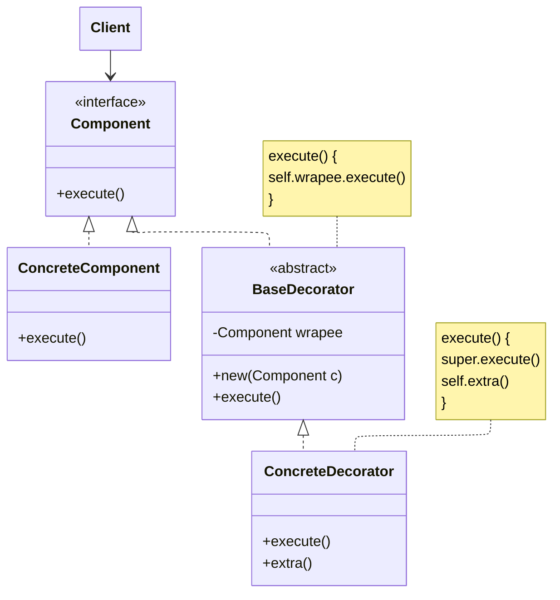

**Decorator** design pattern (often referred to also as **Wrapper**) "wraps" a base object with additional features.

This pattern can be used when modifying the behavior of external objects.

## Example

For example, a `DataSource`.  In this case, we create a "base" decorator `DataSourceDecorator` and implement it with our decorators `EncryptionDecorator` and `CompressionDecorator`.

We can then use this decorators on our concrete data sources, e.g., `FileDataSource` or `S3DataSource`. We can wrap them with `EncryptionDecorator`, with `CompressionDecorator`, or even both!

## Application

- Assign an extra behavior to an existing an object at runtime, before or after the actual behavior.

## Structure

