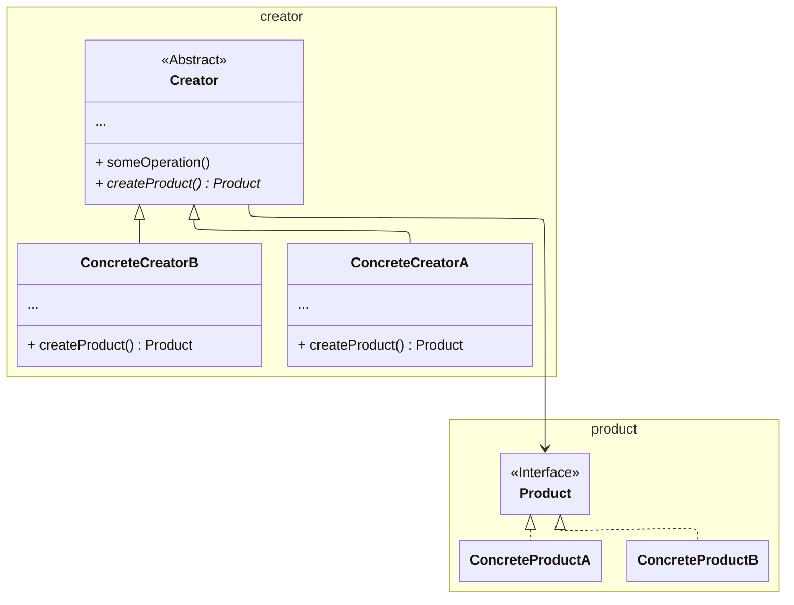

**Factory Method** is a creational design pattern that provides an interface for creating objects in a supertrait, but allows subtraits to alter the type of objects that will be created.

---

## Structure

## Applicability

Use the Factory Method when you:

- <u>Don’t know beforehand the exact types</u> and dependencies of the objects your code should work with.
- Want to provide users of your library or framework with a way to <u>extend its internal components</u>.

	