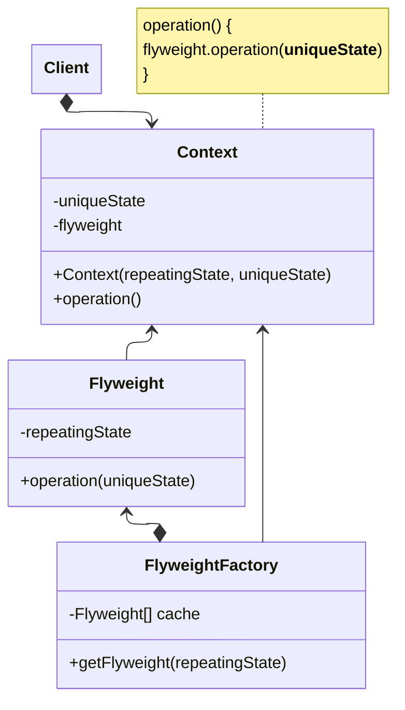

**Flyweight** is a design pattern for reducing memory usage, by separating static, common values from an object's state.

The [source material](https://refactoring.guru/design-patterns/flyweight) introduces two relevant concepts for object state:

1. **Intrinsic** state: State data belonging to the object. Other objects can only read it, not modify it.
2. **Extrinsic** state: Data not belonging to the object. Often altered "from the outside" by other objects.

Flyweight pattern proposes that you extract extrinsic state, and pass it only as a function parameter instead of storing it in the object - only intrinsic state.

## Structure

