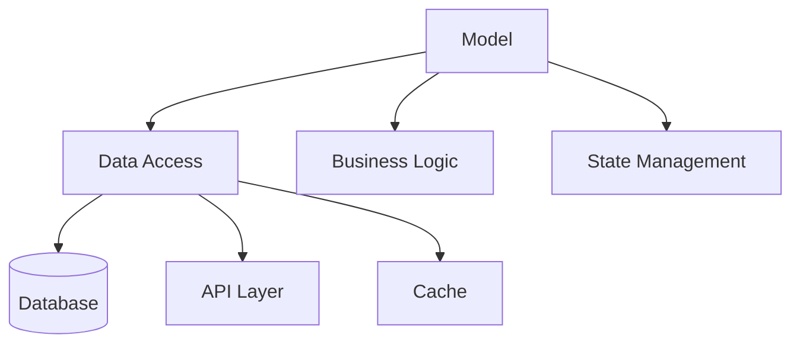

## Definition

The **Model** layer is responsible for data access and business logic in UI architectural patterns.

## Responsibilities

- **Data Access**: Interfaces with databases, APIs, and data sources
- **Business Logic**: Contains domain rules and validation
- **State Management**: Manages application state and data consistency

## Key Characteristics

- **Independence**: Model has no knowledge of View or Controller/Presenter
- **Reusability**: Can be shared across different Views
- **Testability**: Easy to unit test in isolation
- **Single Source of Truth**: Maintains consistent data state

## Interactions

The Model communicates only with the translator component (Controller, Presenter, Interactor, or ViewModel) and never directly with the View. This ensures:

1. View cannot corrupt business logic
2. Changes to UI don't affect business rules
3. Model can be tested independently

## Pattern Usage

| Pattern                                            | Model Role                                                                                       |
| -------------------------------------------------- | ------------------------------------------------------------------------------------------------ |
| [[3 Reference/mvc-(model-view-controller)_202604091518\|MVC]]  | Updated by Controller, notifies View (Active View) or provides data to Controller (Passive View) |
| [[3 Reference/mvp-(model-view-presenter)_202604091519\|MVP]]   | Updated by Presenter, returns data to Presenter                                                  |
| [[3 Reference/mvvm-(model-view-viewmodel)_202604091519\|MVVM]] | Updated by ViewModel, observed via data streams                                                  |
| [[3 Reference/viper_202604091519\|VIPER]]                      | Managed by Interactor, contains Entities                                                         |

## Related

- [[3 Reference/view-(ui-pattern)_202604091520\|View]]
- [[3 Reference/translator-component_202604091520\|Translator Component]]