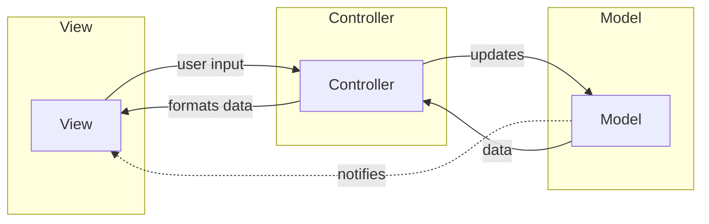

## Definition

MVC separates application into three components: **Model**, **View**, and **Controller**. The Controller handles user input and coordinates Model-View updates.

## Flow

1. **View** receives user input, notifies **Controller**
2. **Controller** updates **Model** based on user input
3. **Model** sends updated data back through the chain

## View Types

There are two types of View depending on how it interacts with Model:

### Passive View

- View gets data **only** through the Controller
- View is not aware of Model
- Controller acts as the sole mediator

### Active View

- Model notifies View of changes
- View queries Model for updated data
- Controller only handles input events

## Disadvantages

- Controller becomes bloated as complexity grows
- Tight coupling between Controller and View in some implementations

## Components

- [[3 Reference/model-(ui-pattern)_202604091520\|Model]]
- [[3 Reference/view-(ui-pattern)_202604091520\|View]]
- [[3 Reference/controller-(mvc)_202604091521\|Controller]]

## Variants

- [[3 Reference/mvc-c-(model-view-controller-coordinator)_202604091519\|MVC-C (with Coordinator)]]
- [[3 Reference/passive-view_202604091522\|Passive View]]
- [[3 Reference/active-view_202604091523\|Active View]]

## Related

- [[3 Reference/mvp-(model-view-presenter)_202604091519\|MVP (Model View Presenter)]]
- [[3 Reference/mvvm-(model-view-viewmodel)_202604091519\|MVVM (Model View ViewModel)]]