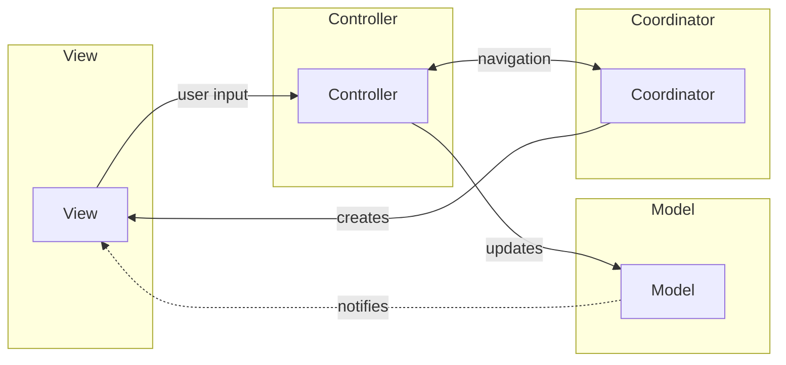

## Definition

MVC-C extends MVC by adding a **Coordinator** to handle navigation flow, separating navigation logic from Controllers. This pattern is useful for applications with complex navigation requirements.

## Flow

1. **View** receives user input, notifies **Controller**
2. **Controller** updates **Model** based on user input
3. **Controller** delegates navigation decisions to **Coordinator**
4. **Coordinator** manages screen transitions and creates new Views

## Coordinator Benefits

- **Separation of Navigation**: Navigation logic removed from Controllers
- **Reusable Controllers**: Controllers can be reused in different navigation contexts
- **Centralized Routing**: All navigation flows in one place
- **Deep Link Support**: Coordinators handle URL routing elegantly

## Use Case

Implemented in pwr-bot Discord UI components for managing complex view navigation and state transitions.

## When to Use

- Applications with complex navigation flows
- Multi-module applications
- Apps requiring deep linking
- Projects where Controllers become too heavy with navigation code

## Components

- [[3 Reference/model-(ui-pattern)_202604091520\|Model]]
- [[3 Reference/view-(ui-pattern)_202604091520\|View]]
- [[3 Reference/controller-(mvc)_202604091521\|Controller]]
- [[3 Reference/coordinator_202604091522\|Coordinator]]

## Related

- [[3 Reference/mvc-(model-view-controller)_202604091518\|MVC (Model View Controller)]]
- [[3 Reference/mvvm-c-(model-view-viewmodel-controller)_202604091519\|MVVM-C]]