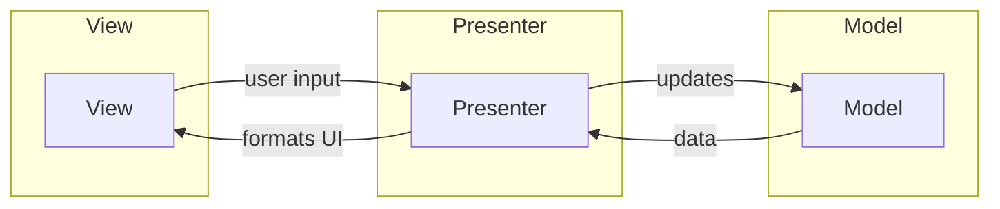

## Definition

MVP separates application into **Model**, **View**, and **Presenter**. The Presenter handles all UI logic and acts as the sole mediator between Model and View.

## Flow

1. **View** receives user input, notifies **Presenter**
2. **Presenter** updates **Model** based on user input
3. **Model** sends updated data to **Presenter**
4. **Presenter** updates UI based on new data through **View**

## Presenter Responsibilities

The Presenter handles UI logic:

- Transform model data for display
- Handle user input
- Coordinate Model and View updates
- Format data for View presentation

## Key Characteristics

- View has no direct knowledge of Model
- Presenter contains all presentation logic
- View is passive (only displays what Presenter provides)
- Easier to test than MVC (View can be mocked)

## Components

- [[3 Reference/model-(ui-pattern)_202604091520\|Model]]
- [[3 Reference/view-(ui-pattern)_202604091520\|View]]
- [[3 Reference/presenter_202604091521\|Presenter]]

## Related

- [[3 Reference/mvc-(model-view-controller)_202604091518\|MVC (Model View Controller)]]
- [[3 Reference/mvvm-(model-view-viewmodel)_202604091519\|MVVM (Model View ViewModel)]]
- [[3 Reference/viper_202604091519\|VIPER]]