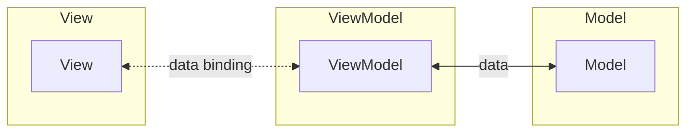

## Definition

MVVM separates application into **Model**, **View**, and **ViewModel**. The ViewModel exposes data streams/state that the View binds to via data binding.

## Flow

1. **View** binds to **ViewModel** properties via data binding
2. **ViewModel** exposes observables/state for View consumption
3. User interactions in **View** trigger commands in **ViewModel**
4. **ViewModel** updates **Model** and notifies View through bindings

## ViewModel Responsibilities

The ViewModel acts as an abstraction of the View:

- Exposes data as observable streams or state
- Contains presentation logic and state management
- Handles user interaction commands
- Transforms Model data for View display
- Does not reference View directly

## Key Characteristics

- **Data Binding**: View automatically updates when ViewModel state changes
- **Declarative UI**: View declares bindings rather than imperatively updating
- **Testability**: ViewModel can be tested without UI
- **Separation of Concerns**: View handles UI, ViewModel handles logic

## Common Implementations

- Android: Jetpack Compose, LiveData, StateFlow
- iOS: SwiftUI with @State, @Published
- Web: React with state hooks, Vue with reactive data
- Desktop: WPF, Avalonia

## Components

- [[3 Reference/model-(ui-pattern)_202604091520\|Model]]
- [[3 Reference/view-(ui-pattern)_202604091520\|View]]
- [[3 Reference/viewmodel_202604091521\|ViewModel]]

## Variants

- [[3 Reference/mvvm-c-(model-view-viewmodel-controller)_202604091519\|MVVM-C (with Coordinator)]]

## Related

- [[3 Reference/mvc-(model-view-controller)_202604091518\|MVC (Model View Controller)]]
- [[3 Reference/mvp-(model-view-presenter)_202604091519\|MVP (Model View Presenter)]]