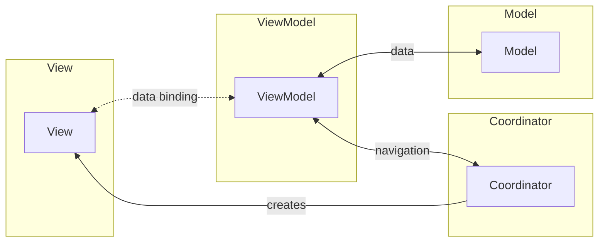

## Definition

MVVM-C extends MVVM by adding a **Coordinator** (also called Router) to handle navigation and screen flow, separating navigation logic from the ViewModel.

## Flow

1. **Coordinator** manages navigation between screens
2. **View** binds to **ViewModel** for data and commands
3. **ViewModel** handles business logic and delegates navigation to **Coordinator**
4. Navigation flow is decoupled from ViewModels

## Coordinator Responsibilities

The Coordinator (Router) handles navigation:

- Manages screen transitions and navigation stack
- Creates and configures new Views/ViewModels
- Handles deep linking and URL routing
- Coordinates between multiple ViewModels
- Keeps navigation logic separate from ViewModels

## Key Characteristics

- **All MVVM benefits**: Data binding, testability, separation of concerns
- **Clean Navigation**: Navigation logic extracted from ViewModels
- **Composable**: Screens can be combined and rearranged easily
- **Deep Link Support**: Coordinators can handle external navigation requests

## Common Use Cases

- iOS apps using MVVM with Coordinators
- Android apps with Navigation Component
- React/React Native with navigation libraries
- Desktop applications with complex navigation flows

## Components

- [[model-(ui-pattern)_202604091520|Model]]
- [[view-(ui-pattern)_202604091520|View]]
- [[viewmodel_202604091521|ViewModel]]
- [[coordinator_202604091522|Coordinator]]

## Related

- [[mvvm-(model-view-viewmodel)_202604091519|MVVM (Model View ViewModel)]]
- [[mvc-c-(model-view-controller-coordinator)_202604091519|MVC-C (Model View Controller Coordinator)]]
- [[viper_202604091519|VIPER]]
