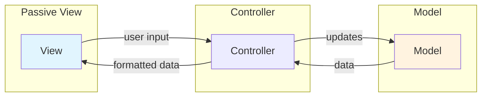

## Definition

**Passive View** is a View variant in MVC where the View gets data **only** through the Controller and has no direct knowledge of the Model.

## Key Characteristics

- **No Model Access**: View cannot query Model directly
- **Data from Controller Only**: All data comes through Controller
- **Minimal Logic**: View is purely presentation-focused
- **High Testability**: Controller can be tested with mocked View

## Comparison

| Aspect | Passive View | Active View |
|--------|--------------|-------------|
| Data Source | Controller only | Model directly |
| Model Awareness | None | Observes Model |
| Controller Role | Input + Data formatting | Input only |
| Testability | Higher (full mediation) | Lower (Model coupling) |

## Advantages

1. <u>Complete separation</u> between View and Model
2. Controller acts as single source of truth for View
3. Easier to mock View in Controller tests
4. View can be simple UI template

## Related

- [[3 Reference/mvc-(model-view-controller)_202604091518\|MVC (Model View Controller)]]
- [[3 Reference/active-view_202604091523\|Active View]]