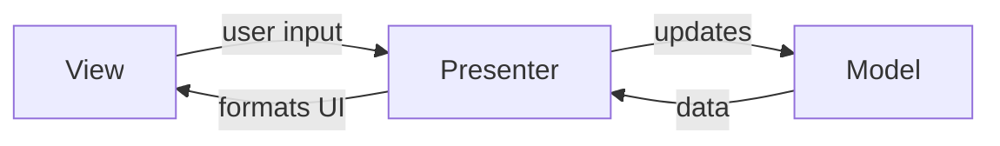

## Definition

The **Presenter** is the translator component in MVP and VIPER patterns. It handles all UI logic, transforms Model data for display, and acts as the sole mediator between Model and View.

## Responsibilities

- **UI Logic**: Contains all presentation logic
- **Data Transformation**: Converts Model data for View display
- **Input Coordination**: Handles user input from View
- **View Updates**: Directly calls View methods to update UI

## Key Characteristics

- **Mediator Role**: Complete separation between Model and View
- **Testability**: Presenter can be tested with mocked View
- **View Invoker**: Presenter actively calls View methods (not data binding)
- **Stateless**: Ideally holds no state (state lives in Model or View)

> [!TIP] Presenter vs Controller
> Unlike Controllers, Presenters format **all** data for the View. The View has no direct knowledge of the Model. This makes Presenters more testable but can lead to more verbose code.

## Presenter in Different Patterns

| Pattern | Presenter Role |
|---------|----------------|
| MVP | Handles UI logic, formats data, updates View |
| VIPER | Receives prepared data from Interactor, formats for View |

## Best Practices

- **Keep View Passive**: View should only display what Presenter provides
- **Interface-Based**: Define View as protocol/interface for testability
- **Avoid View State**: Let Model or View manage state, not Presenter

## Comparison with Other Translators

| Component | Focus | Data Flow |
|-----------|-------|-----------|
| Controller | Input handling | User → Controller → Model |
| Presenter | View formatting | Model → Presenter → View |
| ViewModel | State binding | Model ↔ ViewModel ↔ View |

## Related

- [[mvp-(model-view-presenter)_202604091519|MVP (Model View Presenter)]]
- [[viper_202604091519|VIPER]]
- [[controller-(mvc)_202604091521|Controller]]
- [[viewmodel_202604091521|ViewModel]]
