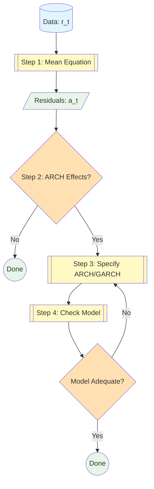

## Procedure

A systematic four-step approach to building ARCH/GARCH models for asset return series.

## Overview

Building a volatility model consists of four sequential steps, moving from the mean equation to the volatility specification and finally to model validation.

## Step 1: Specify the Mean Equation

Test for serial dependence in the [[time-series-data_202603161400|return data]] and build an econometric [[forecasting-methods-cheatsheet_202603292104|model]] to remove any linear dependence.

**Actions:**

- Examine [[sample-autocorrelation_202603161400|ACF]]/[[partial-autocorrelation-(pacf)_202603300223|PACF]] of returns $\{r_t\}$
- Fit an appropriate model ([[armapq-process-model_202603161400|ARMA]]/[[arima-pdq-model-definition_202603161400|ARIMA]]) if needed:
  $$
  r_t = \mu_t + a_t
  $$
- $\mu_t$ can be modeled with regression or ARMA specification
- The goal is to obtain residuals $\{a_t\}$ that are serially uncorrelated

**Check:** [[ljung-box-test_202603300222|Ljung-Box test]] on $\{a_t\}$ should not reject [[white-noise_202603161400|white noise]]

## Step 2: Test for ARCH Effects

Use the squared residuals from the mean equation to test for ARCH effects.

**Actions:**

- Compute squared residuals $\{a_t^2\}$
- Apply [[procedure-testing-for-arch-effects_202604201225|tests for ARCH effects]]:
  - Ljung-Box test on $\{a_t^2\}$
  - LM test (Lagrange Multiplier)

**Decision:**

- If tests are significant → proceed to Step 3
- If not significant → no ARCH effects present, standard model suffices

## Step 3: Specify a Volatility Model

If ARCH effects are significant, specify and estimate a volatility model.

**Actions:**

- Use PACF of $\{a_t^2\}$ to determine ARCH order $m$
- Consider GARCH for parsimony (often GARCH(1,1) suffices)
- Perform **joint estimation** of mean and volatility equations
- Use [[procedure-maximum-likelihood-estimation-for-arch-garch_202604201225|Maximum Likelihood Estimation]]

**Typical specification:**

$$
r_t = \mu + a_t, \quad a_t = \sigma_t \epsilon_t, \quad \sigma_t^2 = \alpha_0 + \alpha_1 a_{t-1}^2 + \beta_1 \sigma_{t-1}^2
$$

## Step 4: Check the Fitted Model

Carefully check the fitted model and refine if necessary.

**Actions:**

- Compute [[definition-standardized-residuals_202604201223|standardized residuals]]: $\tilde{a}_t = \hat{a}_t / \hat{\sigma}_t$
- Apply [[procedure-model-checking-for-arch-garch_202604201225|diagnostic checks]]
- If inadequacies found, return to Step 3 and modify specification

## Flowchart

## Related

- [[procedure-testing-for-arch-effects_202604201225|Testing for ARCH Effects]]
- [[procedure-maximum-likelihood-estimation-for-arch-garch_202604201225|Maximum Likelihood Estimation for ARCH/GARCH]]
- [[procedure-model-checking-for-arch-garch_202604201225|Model Checking for ARCH/GARCH]]
