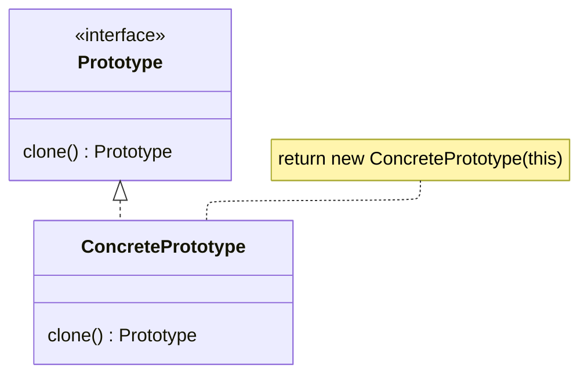

## About

Basically `Clone` in Rust or `Cloneable` in Java.

Though Java does not have a `Self` return type like Rust, so `Prototype` in `Java` would return another `Prototype`, and the caller downcasts into the concrete type.

For "cloning" a model object with the same exact fields.

For a service object, the fields are usually a reference with reference counting such as Rc or Arc.

## Structure

