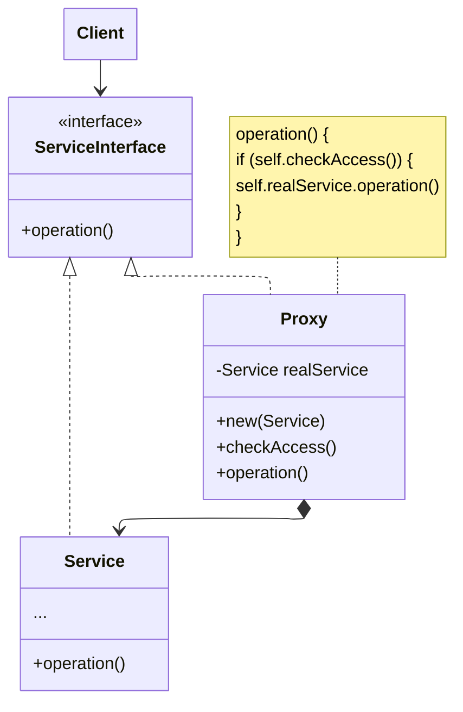

**Proxy** design pattern lets you provide a substitute or placeholder for another object. The client uses proxy as if using with the original object.

The **proxy** controls access to the original object, allowing you to perform something either before or after the request gets through to the original object.

## Structure

Example with access control

## Applicability

- Lazy initialization: Create object only when first needed
- Access control: The proxy can pass the request to the service object only if the client’s credentials match some criteria (middlewares)
- Caching
- Smart reference: Drop when no clients is using it

## Relations with Other Patterns

![[adapter-vs-proxy-vs-decorator_202606071804#^e91d50|e91d50]]

- [[facade-design-pattern_202606040522|Facade]] is similar with **Proxy** in that both buffer a complex entity.
  Unlike Facade, **Proxy** <u>has the same interface as its service object</u>
- Proxy usually <u>manages the life cycle</u> of its service object on its own,
  whereas the composition of Decorators is <u>always controlled by the client</u>
