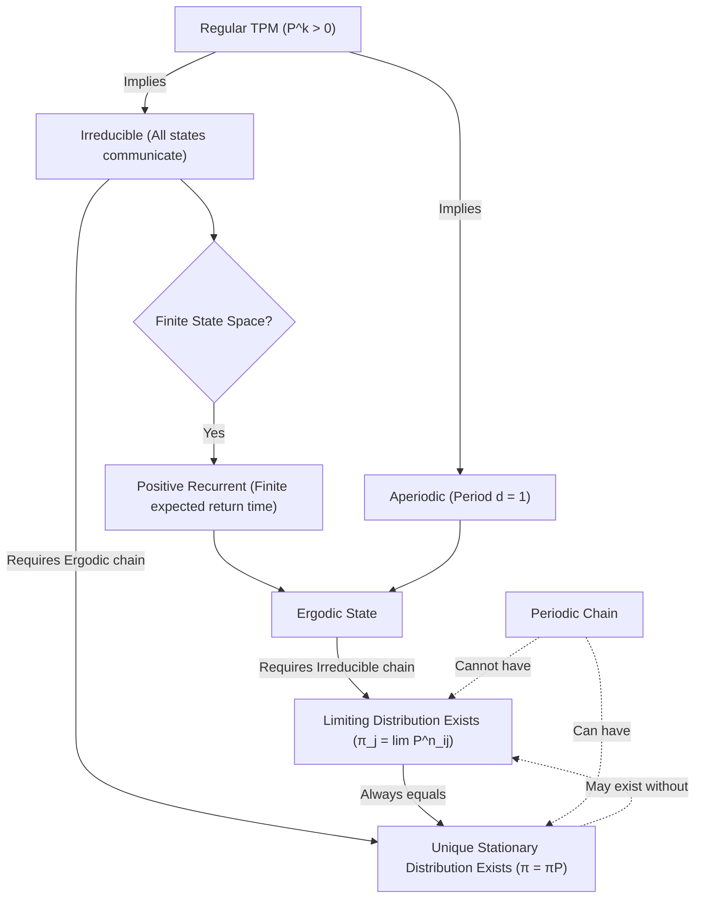

Here is a summary of the relationships between the core concepts in stochastic models and Markov chains, particularly focusing on state classification and long-term behavior.

## Core Property Implications

The following visual map shows how different properties of Markov chains and their states logically imply one another.

## Concept Summaries

### Regular vs Irreducible vs Aperiodic

- **[[3 Reference/def-regular-tpm_202603280832\|Regular TPM]]**: A transition matrix where some power $\mathbf{P}^k$ has all strictly positive entries.
  - *Implies*: The chain is both [[3 Reference/def-irreducible_202603280823\|irreducible]] and [[3 Reference/def-period-stochastic_202603280825\|aperiodic]] ([[3 Reference/theorem-regular-irreducible-aperiodic_202603280901\|Theorem]]).
- **[[3 Reference/def-irreducible_202603280823\|Irreducible]]**: All states communicate with each other (one single communicating class).
- **[[3 Reference/def-period-stochastic_202603280825\|Aperiodic]]**: The period of a state is $d=1$, meaning you can return to it at irregular times (no fixed cycle).

### Ergodic States

An **[[3 Reference/def-ergodic-state_202603280835\|Ergodic State]]** is a state that is both:
1. **[[3 Reference/about-positive-recurrent_202603280902\|Positive Recurrent]]**: The expected time to return to the state is finite.
2. **[[3 Reference/def-period-stochastic_202603280825\|Aperiodic]]**.

*Note: In a finite irreducible Markov chain, all states are positive recurrent. If the chain is also aperiodic, all states are ergodic.*

### Limiting vs Stationary Distributions

- **[[3 Reference/def-limiting-probability_202603280831\|Limiting Distribution]]**: The long-run probability of being in a state, independent of the starting state ($\pi_j = \lim_{n \to \infty} P_{ij}^n$).
  - *Requires*: An irreducible, ergodic (which implies aperiodic) Markov chain ([[3 Reference/theorem-limiting-distribution_202603280833\|Theorem]]).
  - *Always*: If it exists, it is **always** a stationary distribution.
- **[[3 Reference/def-stationary-distribution_202603280834\|Stationary Distribution]]**: A probability vector $\pi$ such that $\pi = \pi \mathbf{P}$. If you start with this distribution, you stay in it.
  - *May Exist Without*: A stationary distribution can exist even if a limiting distribution does not (e.g., in periodic chains where probabilities cycle and do not converge to a single limit).
  - *Uniqueness*: For an irreducible ergodic chain, there is a unique stationary distribution, which is equal to the limiting distribution.