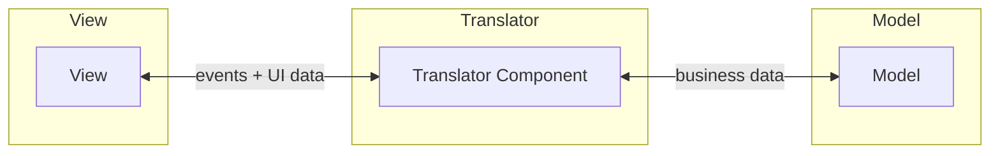

## Definition

The **Translator Component** is the mediator between Model and View in UI architectural patterns. It handles the interaction logic and data transformation between the two layers.

## Responsibilities

- **Mediation**: Coordinates between Model and View
- **Transformation**: Converts Model data for View display
- **Input Handling**: Processes user input from View
- **State Management**: Manages UI state (in some patterns)

## Translator Types by Pattern

| Pattern | Translator Name | Primary Role |
|---------|-----------------|--------------|
| [[3 Reference/mvc-(model-view-controller)_202604091518\|MVC]] | [[3 Reference/controller-(mvc)_202604091521\|Controller]] | Handles input, updates Model |
| [[3 Reference/mvp-(model-view-presenter)_202604091519\|MVP]] | [[3 Reference/presenter_202604091521\|Presenter]] | Handles UI logic, formats data |
| [[3 Reference/mvvm-(model-view-viewmodel)_202604091519\|MVVM]] | [[3 Reference/viewmodel_202604091521\|ViewModel]] | Exposes state, data binding |
| [[3 Reference/mvvm-c-(model-view-viewmodel-controller)_202604091519\|MVVM-C]] | ViewModel + [[3 Reference/coordinator_202604091522\|Coordinator]] | State + navigation |
| [[3 Reference/viper_202604091519\|VIPER]] | Presenter + Interactor + Router | Separated concerns |

## Key Characteristics

- **No Direct View-Model Communication**: Translator ensures View and Model never interact directly
- **Testability**: Translator can be tested without UI
- **Single Responsibility**: Each translator type has distinct responsibilities

## Evolution

> [!TIP] Evolution of Translator Components
> Translators evolved from simple Controllers (MVC) to more specialized components:
> - **Controller**: Input-focused
> - **Presenter**: View-focused (formats everything for View)
> - **ViewModel**: Binding-focused (exposes observable state)
> - **Interactor**: Business-logic-focused (VIPER)

## Related

- [[3 Reference/model-(ui-pattern)_202604091520\|Model]]
- [[3 Reference/view-(ui-pattern)_202604091520\|View]]