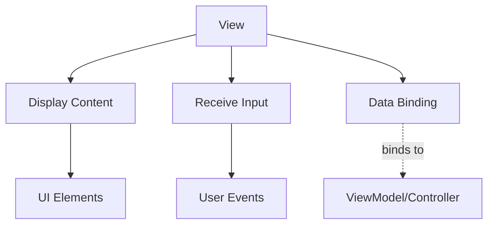
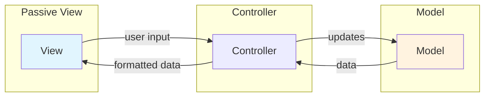
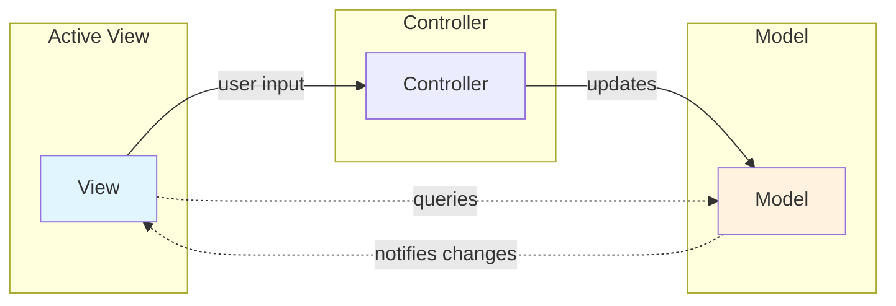

## Definition

The **View** layer is responsible for presenting UI content to the user and receiving user input.

## Responsibilities

- **Presentation**: Renders UI elements and displays data
- **User Input**: Receives and forwards user interactions
- **Binding**: Connects to Model/ViewModel state (in MVVM patterns)

## Key Characteristics

- **Passive**: Contains minimal logic (ideally none)
- **Declarative**: Describes what to display, not how
- **Reusable**: Can be swapped without affecting business logic

## Passive View

**Passive View** is a View variant where the View gets data **only** through the translator component (Controller/Presenter) and has no direct knowledge of the Model.

### Key Characteristics

- **No Model Access**: View cannot query Model directly
- **Data from Controller Only**: All data comes through Controller
- **Minimal Logic**: View is purely presentation-focused
- **High Testability**: Controller can be tested with mocked View

### Advantages

1. <u>Complete separation</u> between View and Model
2. Controller acts as single source of truth for View
3. Easier to mock View in Controller tests
4. View can be simple UI template

### Disadvantages

1. Controller must handle all data formatting
2. More boilerplate code for data passing
3. Potential performance overhead from full mediation

## Active View

**Active View** is a View variant where the View observes the Model directly for changes and queries the Model for updated data. The Controller only handles input events.

### Key Characteristics

- **Direct Model Access**: View queries Model for data
- **Observation Pattern**: View observes Model changes automatically
- **Lightweight Controller**: Controller only handles input routing
- **Reactive**: View updates automatically when Model changes

### Implementation Patterns

- **Observer Pattern**: View registers as observer of Model
- **Event Bus**: View subscribes to Model change events
- **Reactive Streams**: View binds to Model data streams

### Advantages

1. <u>More responsive</u> — View updates immediately when Model changes
2. Controller stays lightweight
3. Enables real-time data synchronization

### Disadvantages

1. Tighter coupling between View and Model
2. View tests need Model mocking
3. Harder to reason about data flow

## Comparison

| Aspect | Passive View | Active View |
|--------|--------------|-------------|
| Data Source | Controller only | Model directly |
| Model Awareness | None | Observes Model |
| Controller Role | Input + Data formatting | Input only |
| Testability | Higher (full mediation) | Lower (Model coupling) |

## Pattern Usage

| Pattern | View Role |
| ------- | --------- |
| [[mvc-(model-view-controller)_202604091518\|MVC]] | Notifies Controller of user input; displays formatted data |
| [[mvp-(model-view-presenter)_202604091519\|MVP]] | Delegates all logic to Presenter; displays Presenter-formatted data |
| [[mvvm-(model-view-viewmodel)_202604091519\|MVVM]] | Binds to ViewModel properties; declarative updates |
| [[viper_202604091519\|VIPER]] | Receives formatted data from Presenter; forwards user actions |

## Best Practices

- **Minimal Logic**: Avoid business logic in View
- **Statelessness**: View should be stateless when possible
- **Testability**: View should be easily mockable

## Related

- [[model-(ui-pattern)_202604091520|Model]]
- [[translator-component_202604091520|Translator Component]]
- [[mvc-(model-view-controller)_202604091518|MVC (Model View Controller)]]
