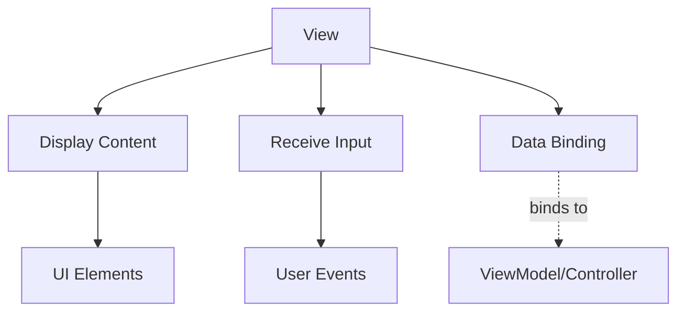

## Definition

The **View** layer is responsible for presenting UI content to the user and receiving user input in UI architectural patterns.

## Responsibilities

- **Presentation**: Renders UI elements and displays data
- **User Input**: Receives and forwards user interactions
- **Binding**: Connects to Model/ViewModel state (in MVVM patterns)

## Key Characteristics

- **Passive**: Contains minimal logic (ideally none)
- **Declarative**: Describes what to display, not how
- **Reusable**: Can be swapped without affecting business logic

## View Variants

| Variant | Description | Data Source |
|---------|-------------|-------------|
| [[3 Reference/passive-view_202604091522\|Passive View]] | Gets data only through translator component | Controller/Presenter |
| [[3 Reference/active-view_202604091523\|Active View]] | Observes Model directly for updates | Model |

## Pattern Usage

| Pattern | View Role |
|---------|-----------|
| [[3 Reference/mvc-(model-view-controller)_202604091518\|MVC]] | Notifies Controller of user input; displays formatted data |
| [[3 Reference/mvp-(model-view-presenter)_202604091519\|MVP]] | Delegates all logic to Presenter; displays Presenter-formatted data |
| [[3 Reference/mvvm-(model-view-viewmodel)_202604091519\|MVVM]] | Binds to ViewModel properties; declarative updates |
| [[3 Reference/viper_202604091519\|VIPER]] | Receives formatted data from Presenter; forwards user actions |

## Best Practices

- **Minimal Logic**: Avoid business logic in View
- **Statelessness**: View should be stateless when possible
- **Testability**: View should be easily mockable

## Related

- [[3 Reference/model-(ui-pattern)_202604091520\|Model]]
- [[3 Reference/translator-component_202604091520\|Translator Component]]