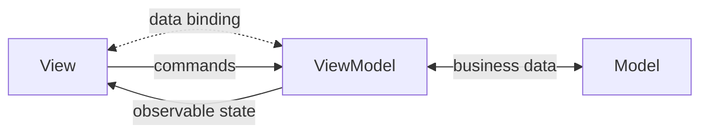

## Definition

The **ViewModel** is the translator component in MVVM and MVVM-C patterns. It exposes data streams and state that the View binds to via data binding mechanisms.



## Responsibilities

- **State Exposure**: Exposes observable properties for View binding
- **Command Handling**: Receives and processes user actions from View
- **Data Transformation**: Converts Model data for View consumption
- **Business Logic**: Contains presentation and UI-related business logic

## Key Characteristics

- **Data Binding**: View automatically updates when ViewModel state changes
- **No View Reference**: ViewModel doesn't hold reference to View
- **Observable**: Properties exposed as streams, state, or published values
- **Testability**: Can be tested without UI framework

> [!TIP] ViewModel vs Presenter
> Unlike Presenters, ViewModels **don't call View methods**. They expose state that Views observe via binding. This enables declarative UI frameworks.

## Platform Implementations

| Platform | Binding Mechanism |
|----------|-------------------|
| Android Jetpack | LiveData, StateFlow, Compose State |
| iOS SwiftUI | @Published, @State, ObservableObject |
| React | useState, useReducer, Context |
| Vue | Reactive proxy, ref, computed |
| WPF/Avalonia | INotifyPropertyChanged, ReactiveUI |

## Common Patterns

```typescript
// ViewModel example (pseudo-code)
class TaskViewModel {
  // Observable state
  tasks: ObservableList<Task>
  isLoading: ObservableBoolean
  
  // Commands
  fun loadTasks() { ... }
  fun addTask(title: String) { ... }
  fun deleteTask(id: String) { ... }
}
```

## Comparison with Other Translators

| Component | Focus | Data Flow |
|-----------|-------|-----------|
| Controller | Input handling | User → Controller → Model |
| Presenter | View formatting | Model → Presenter → View |
| ViewModel | State binding | Model ↔ ViewModel ↔ View |

## Related

- [[3 Reference/mvvm-(model-view-viewmodel)_202604091519\|MVVM (Model View ViewModel)]]
- [[3 Reference/mvvm-c-(model-view-viewmodel-controller)_202604091519\|MVVM-C (Model View ViewModel Controller)]]
- [[3 Reference/presenter_202604091521\|Presenter]]
- [[3 Reference/controller-(mvc)_202604091521\|Controller]]