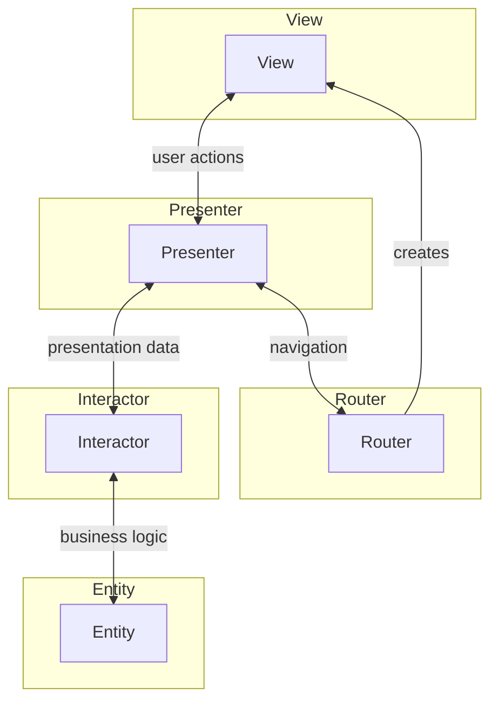

## Definition

VIPER is an architecture pattern that separates application into five distinct components: **View**, **Interactor**, **Presenter**, **Entity**, and **Router**. It originated from Clean Architecture principles and is commonly used in iOS development.

## Flow

1. **View** receives user input and forwards to **Presenter**
2. **Presenter** formats user actions and requests data from **Interactor**
3. **Interactor** performs business logic using **Entity** objects
4. **Interactor** returns result to **Presenter**
5. **Presenter** formats data and updates **View**
6. **Router** handles navigation between scenes/modules

## Component Responsibilities

### View

- Displays data to user
- Receives user input
- Delegates user actions to Presenter
- Passive (no business logic)

### Interactor

- Contains business logic
- Fetches and manipulates data from Entities
- Independent of UI
- Highly testable

### Presenter

- Formats data for View display
- Receives View actions and routes to Interactor
- Handles presentation logic
- Coordinates View and Interactor

### Entity

- Basic model objects
- Data structures
- No business logic
- Used by Interactor

### Router (Wireframe)

- Handles navigation between modules
- Creates new VIPER modules
- Manages navigation stack
- Handles deep linking

## Key Characteristics

- **Strict Separation**: Each component has single responsibility
- **Testability**: Every component can be unit tested independently
- **Modularity**: Each feature is self-contained VIPER module
- **Scalability**: Easy to add new features without affecting existing code

## Common Implementations

- iOS: VIPER is widely adopted in iOS development
- Used with SwiftUI and UIKit
- Often combined with Clean Architecture

> [!NOTE]
> VIPER can be verbose for simple features. Consider project complexity before adopting.

## Components

- [[3 Reference/view-(ui-pattern)_202604091520\|View]]
- [[3 Reference/presenter_202604091521\|Presenter]]

## Related

- [[3 Reference/mvp-(model-view-presenter)_202604091519\|MVP (Model View Presenter)]]
- [[3 Reference/mvvm-c-(model-view-viewmodel-controller)_202604091519\|MVVM-C]]